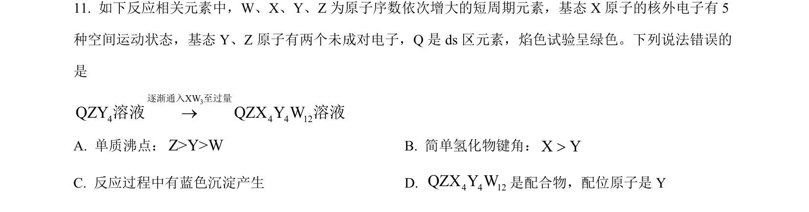
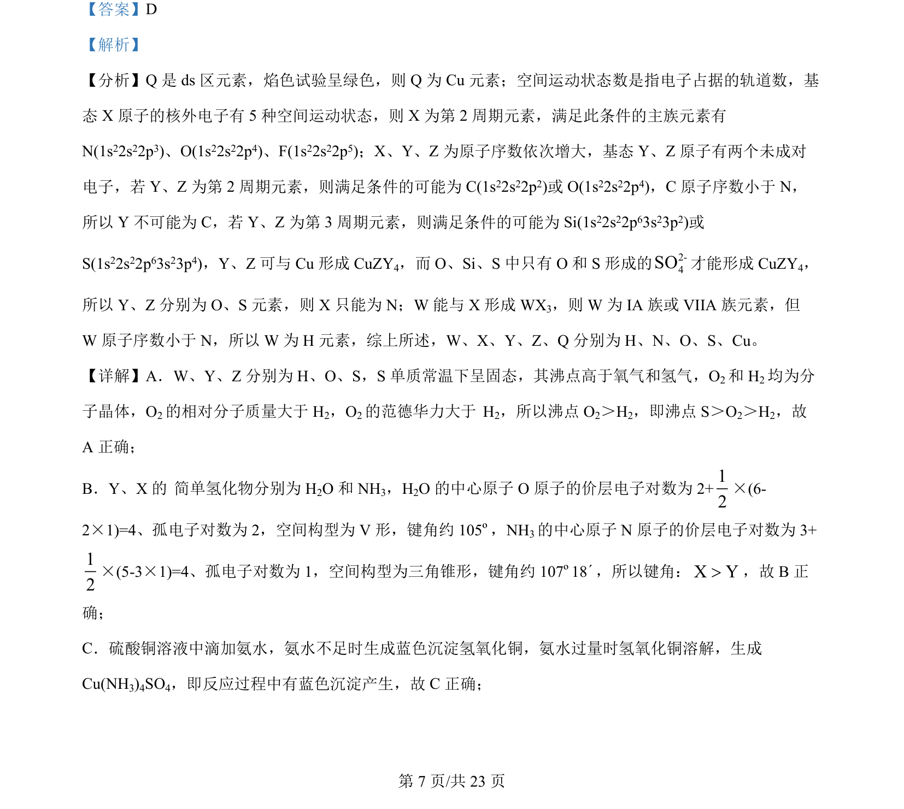
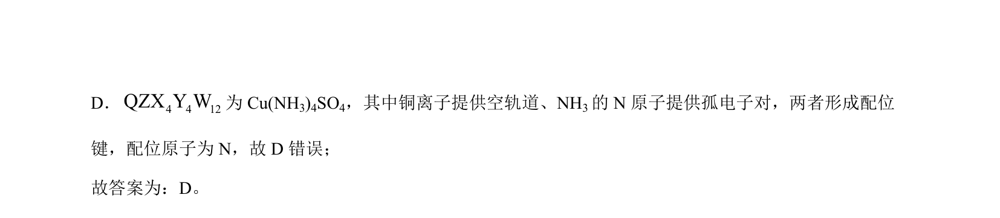

## 题面

## 摘要

本题通过元素推断考查物质结构、沸点比较、键角大小及配合物形成等知识。

## 关联考点

- [[597-元素推断|元素推断]]
- [[603-分子空间构型与键角|分子空间构型与键角]]
- [[894-分子间作用力与沸点|分子间作用力与沸点]]
- [[846-配合物与配位键|配合物与配位键]]

## 答案与解析

> 📄 原 PDF 第 7 页：`素材/真题/吉林/2008-2024·（吉林）化学高考真题/2024年高考化学试卷（辽宁）（解析卷）.pdf`
