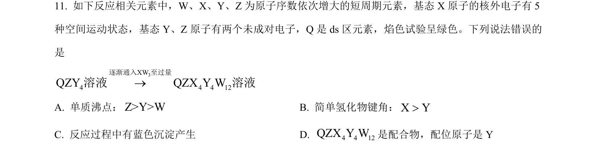
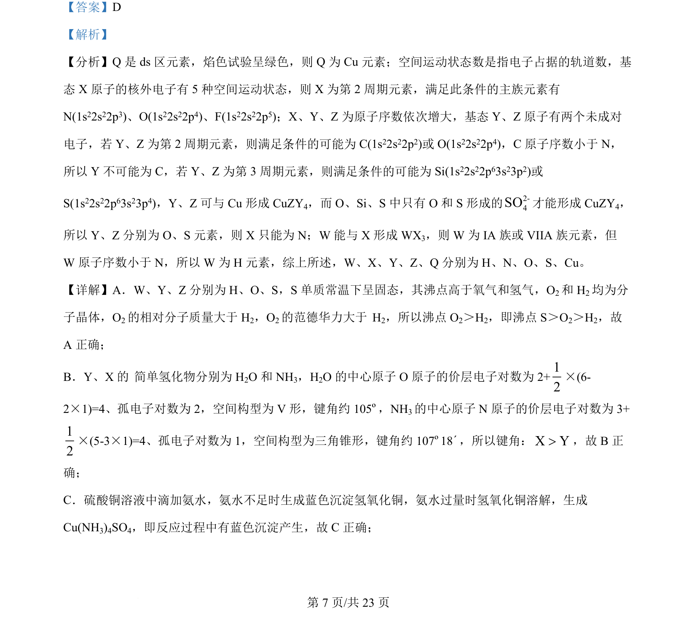
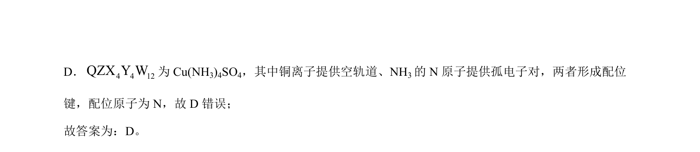

## 题面

## 摘要

本题通过元素推断考查物质结构、沸点比较、键角大小及配合物形成等知识。

## 关联考点

- [[597-元素推断|元素推断]]
- [[603-分子空间构型与键角|分子空间构型与键角]]
- [[894-分子间作用力与沸点|分子间作用力与沸点]]
- [[846-配合物与配位键|配合物与配位键]]

## 答案与解析

> 📄 原 PDF 第 7 页：`素材/真题/吉林/2008-2024·（吉林）化学高考真题/2024年高考化学试卷（辽宁）（解析卷）.pdf`

<!-- 题干文本-start -->
## 题干文本
11. 如下反应相关元素中，W、X、Y、Z为原子序数依次增大的短周期元素，基态 X 原子的核外电子有 5
种空间运动状态，基态 Y、Z原子有两个未成对电子，Q 是 ds 区元素，焰色试验呈绿色。下列说法错误的
是
3XW4 4 4 12QZY QZX Y W®逐渐通入至过量溶液溶液
A. 单质沸点：Z>Y>WB. 简单氢化物键角：X Y>
C. 反应过程中有蓝色沉淀产生 D. 4 4 12QZX Y W是配合物，配位原子是 Y
<!-- 题干文本-end -->

<!-- 解析文本-start -->
## 解析文本
【答案】D
【解析】
【分析】Q 是 ds 区元素，焰色试验呈绿色，则 Q 为 Cu元素；空间运动状态数是指电子占据的轨道数，基
态 X 原子的核外电子有 5 种空间运动状态，则 X 为第 2周期元素，满足此条件的主族元素有
N(1s22s22p3)、O(1s22s22p4)、F(1s22s22p5)；X、Y、Z为原子序数依次增大，基态 Y、Z原子有两个未成对
电子，若 Y、Z为第 2 周期元素，则满足条件的可能为 C(1s22s22p2)或 O(1s22s22p4)，C原子序数小于 N，
所以 Y 不可能为 C，若 Y、Z为第 3 周期元素，则满足条件的可能为 Si(1s22s22p63s23p2)或
S(1s22s22p63s23p4)，Y、Z可与 Cu形成 CuZY4，而 O、Si、S 中只有 O 和 S 形成的2-4SO才能形成 CuZY4，
所以 Y、Z分别为 O、S 元素，则 X 只能为 N；W能与 X 形成 WX3，则 W为 IA 族或 VIIA 族元素，但
W原子序数小于 N，所以 W为 H 元素，综上所述，W、X、Y、Z、Q 分别为 H、N、O、S、Cu。
【详解】A．W、Y、Z分别为 H、O、S，S 单质常温下呈固态，其沸点高于氧气和氢气，O2和 H2均为分
子晶体，O2的相对分子质量大于 H2，O2的范德华力大于 H 2，所以沸点 O2＞H2，即沸点 S＞O2＞H2，故
A 正确；
B．Y、X 的 简单氢化物分别为 H2O 和 NH3，H2O 的中心原子 O 原子的价层电子对数为 2+12
×(6-
2×1)=4、孤电子对数为 2，空间构型为 V 形，键角约 105º，NH3的中心原子 N 原子的价层电子对数为 3+
12
×(5-3×1)=4、孤电子对数为 1，空间构型为三角锥形，键角约 107º18´，所以键角：X Y>，故 B正
确；
C．硫酸铜溶液中滴加氨水，氨水不足时生成蓝色沉淀氢氧化铜，氨水过量时氢氧化铜溶解，生成
Cu(NH3)4SO4，即反应过程中有蓝色沉淀产生，故 C正确；
<!-- 解析文本-end -->
