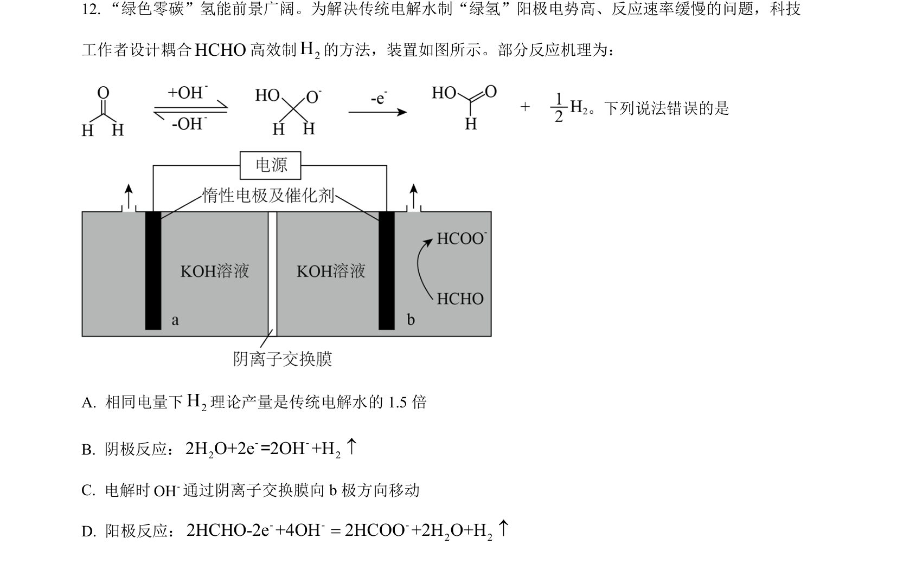
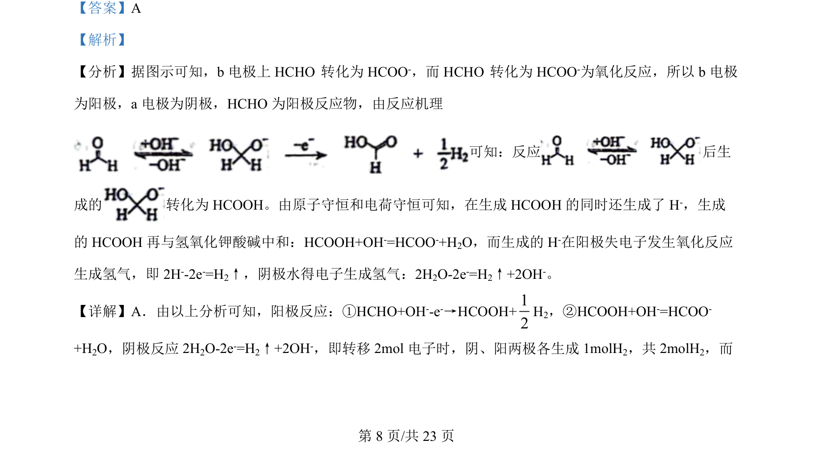
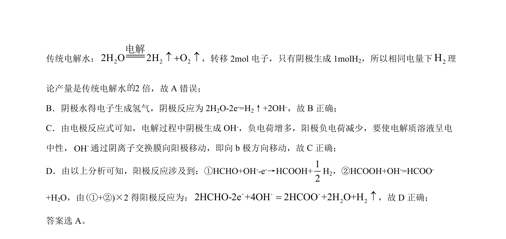

## 题面

## 摘要

电化学电解池中电极反应、电子转移计算及离子移动方向的分析

## 关联考点

- [[790-电化学|电化学]]
- [[794-电极反应|电极反应]]
- [[561-电子守恒|电子守恒]]
- [[805-离子交换膜|离子交换膜]]

## 答案与解析

> 📄 原 PDF 第 8 页：`素材/真题/吉林/2008-2024·（吉林）化学高考真题/2024年高考化学试卷（辽宁）（解析卷）.pdf`
