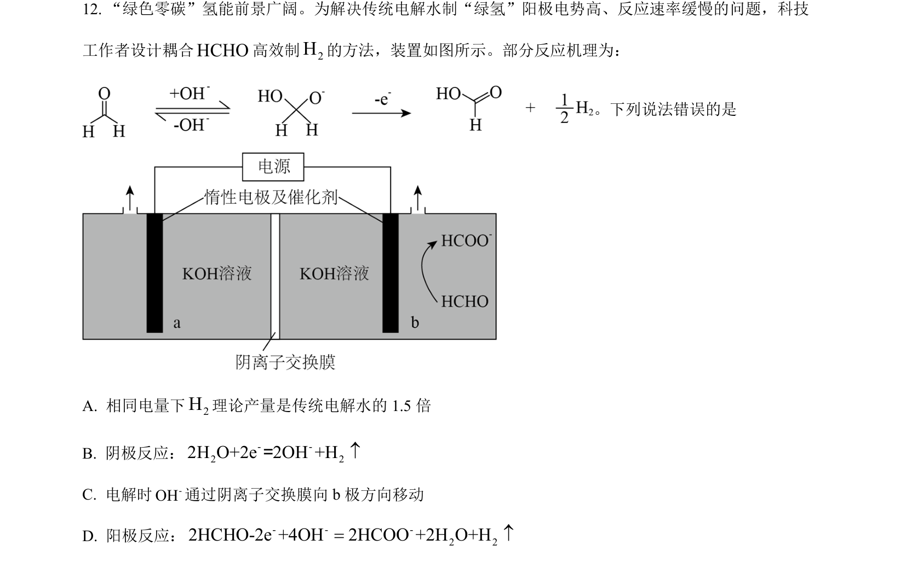
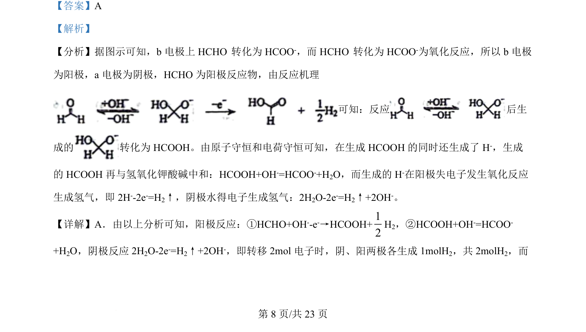
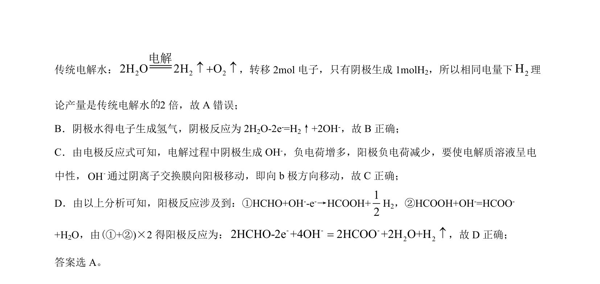

## 题面

## 摘要

电化学电解池中电极反应、电子转移计算及离子移动方向的分析

## 关联考点

- [[789-电化学|电化学]]
- [[793-电极反应|电极反应]]
- [[560-电子守恒|电子守恒]]
- [[804-离子交换膜|离子交换膜]]

## 答案与解析

> 📄 原 PDF 第 8 页：`素材/真题/吉林/2008-2024·（吉林）化学高考真题/2024年高考化学试卷（辽宁）（解析卷）.pdf`

<!-- 题干文本-start -->
## 题干文本
12. “绿色零碳”氢能前景广阔。为解决传统电解水制“绿氢”阳极电势高、反应速率缓慢的问题，科技
工作者设计耦合HCHO高效制2H的方法，装置如图所示。部分反应机理为：
。下列说法错误的是
A. 相同电量下2H理论产量是传统电解水的 1.5 倍
B. 阴极反应： - -2 22H O+2e 2OH +H­=
C. 电解时-OH通过阴离子交换膜向 b 极方向移动
D. 阳极反应： - - -2 22HCHO-2e +4OH 2HCOO +2H O+H=­
<!-- 题干文本-end -->

<!-- 解析文本-start -->
## 解析文本
【答案】A
【解析】
【分析】据图示可知，b 电极上 HCHO 转化为 HCOO-，而 HCHO 转化为 HCOO-为氧化反应，所以 b 电极
为阳极，a电极为阴极，HCHO 为阳极反应物，由反应机理
可知：反应 后生
成的 转化为 HCOOH。由原子守恒和电荷守恒可知，在生成 HCOOH 的同时还生成了 H-，生成
的 HCOOH 再与氢氧化钾酸碱中和：HCOOH+OH-=HCOO-+H2O，而生成的 H-在阳极失电子发生氧化反应
生成氢气，即 2H--2e-=H2↑，阴极水得电子生成氢气：2H2O-2e-=H2↑+2OH-。
【详解】A．由以上分析可知，阳极反应：①HCHO+OH--e-→HCOOH+12
H2，②HCOOH+OH-=HCOO-
+H2O，阴极反应 2H2O-2e-=H2↑+2OH-，即转移 2mol电子时，阴、阳两极各生成 1molH2，共 2molH2，而
<!-- 解析文本-end -->
