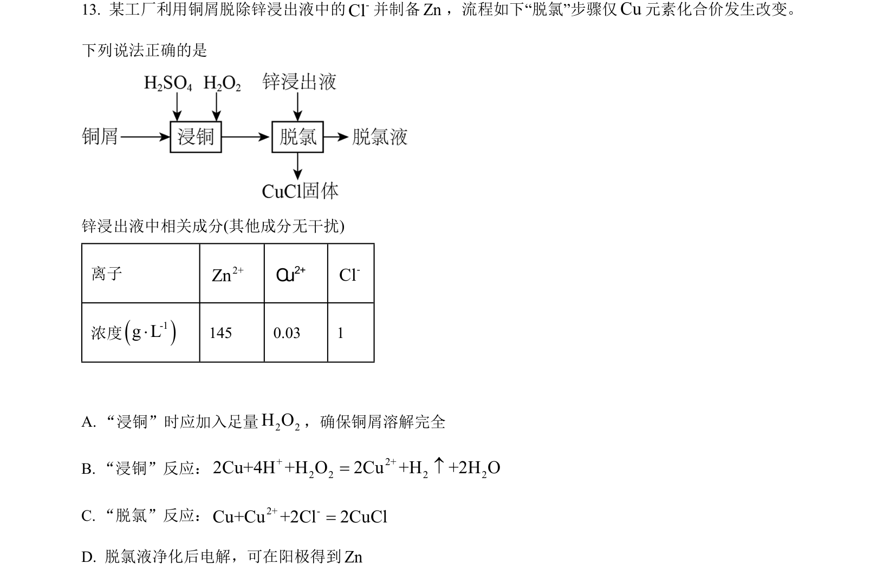
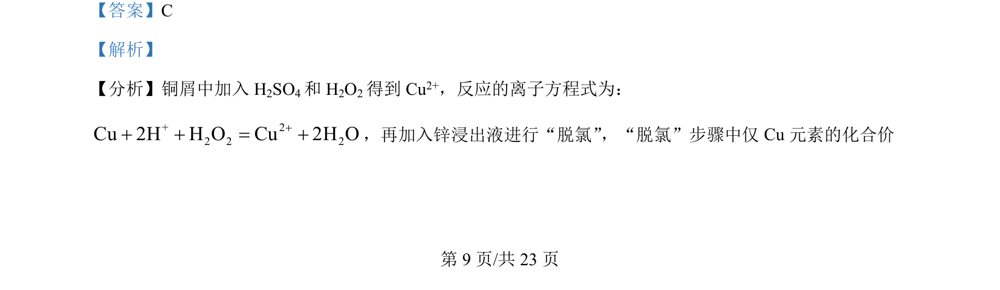
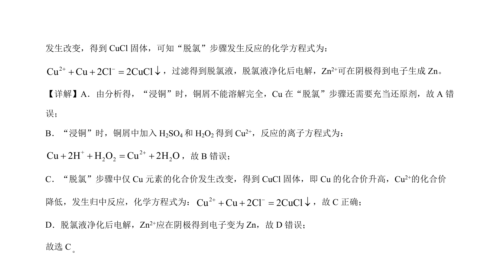

## 题面

## 摘要

该题考查铜回收工艺流程中离子方程式书写、氧化还原反应及电解原理的正误判断

## 关联考点

- [[169-离子反应|离子反应]]
- [[162-氧化还原反应|氧化还原反应]]
- [[367-电解原理|电解原理]]

## 答案与解析

> 📄 原 PDF 第 9 页：`素材/真题/吉林/2008-2024·（吉林）化学高考真题/2024年高考化学试卷（辽宁）（解析卷）.pdf`
