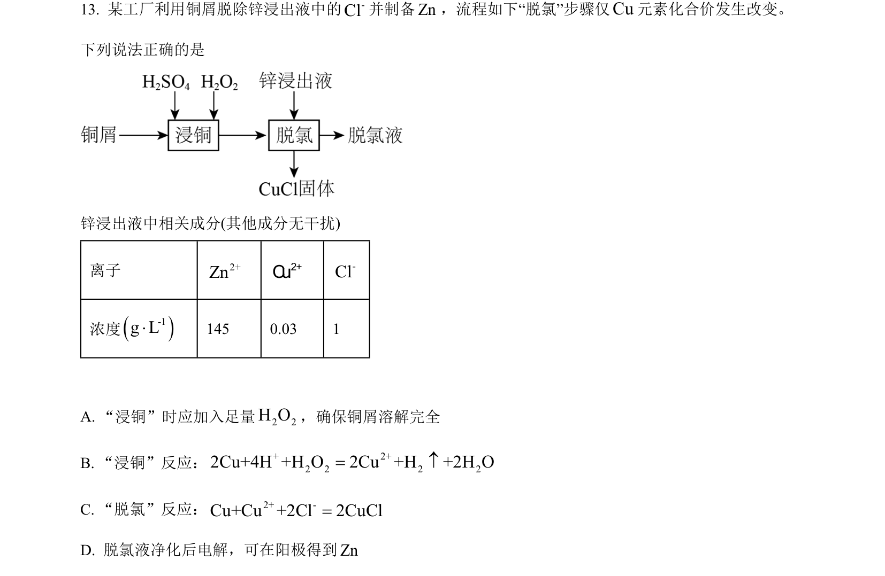
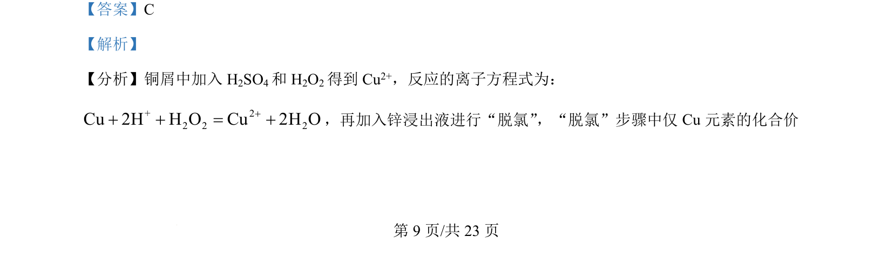
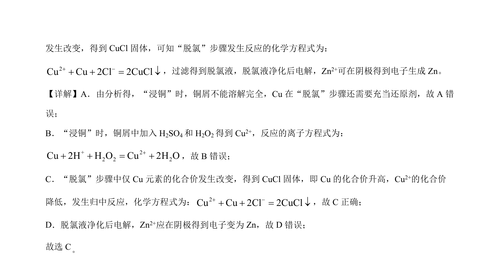

## 题面

## 摘要

该题考查铜回收工艺流程中离子方程式书写、氧化还原反应及电解原理的正误判断

## 关联考点

- [[169-离子反应|离子反应]]
- [[162-氧化还原反应|氧化还原反应]]
- [[367-电解原理|电解原理]]

## 答案与解析

> 📄 原 PDF 第 9 页：`素材/真题/吉林/2008-2024·（吉林）化学高考真题/2024年高考化学试卷（辽宁）（解析卷）.pdf`

<!-- 题干文本-start -->
## 题干文本
13. 某工厂利用铜屑脱除锌浸出液中的-Cl并制备Zn，流程如下“脱氯”步骤仅Cu元素化合价发生改变。
下列说法正确的是
锌浸出液中相关成分(其他成分无干扰)
离子 2+Zn2+C u-Cl
浓度()-1g L×145 0.03 1
A. “浸铜”时应加入足量2 2H O，确保铜屑溶解完全
B. “浸铜”反应： + 2+2 2 2 22Cu+4H +H O 2Cu +H +2H O= ­
C. “脱氯”反应： 2+ -Cu+Cu +2Cl 2CuCl=
D. 脱氯液净化后电解，可在阳极得到Zn
<!-- 题干文本-end -->

<!-- 解析文本-start -->
## 解析文本
【答案】C
【解析】
【分析】铜屑中加入 H2SO4和 H2O2得到 Cu2+，反应的离子方程式为：
+ 22 2 2Cu 2H H O Cu 2H O++ + = +，再加入锌浸出液进行“脱氯”，“脱氯”步骤中仅Cu元素的化合价
的
<!-- 解析文本-end -->
