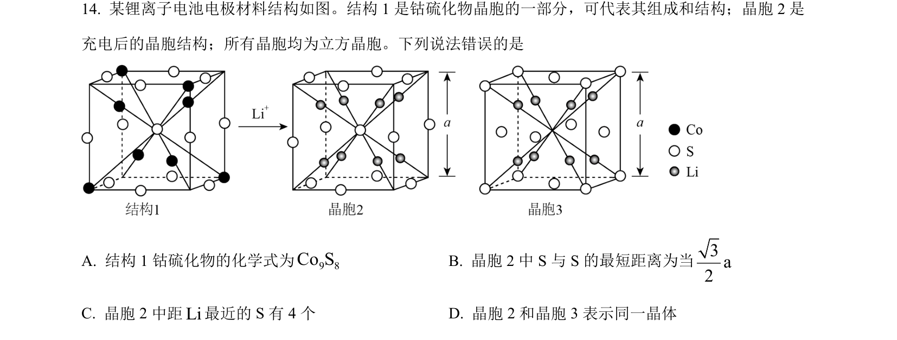
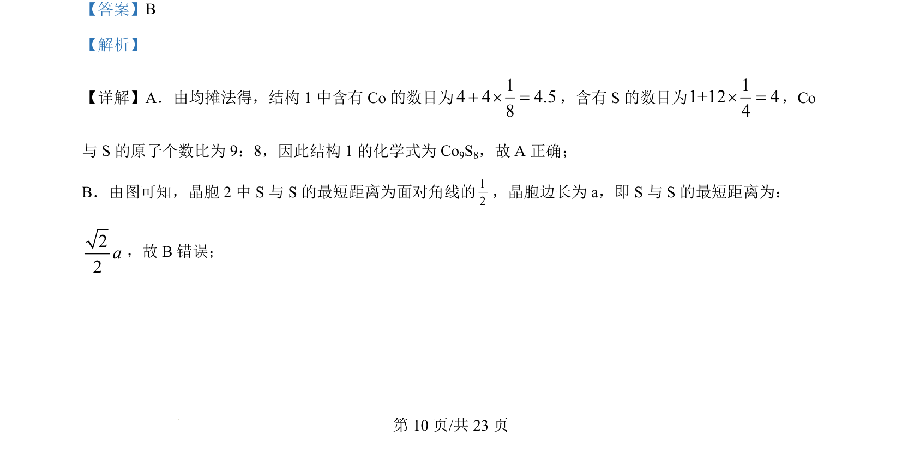
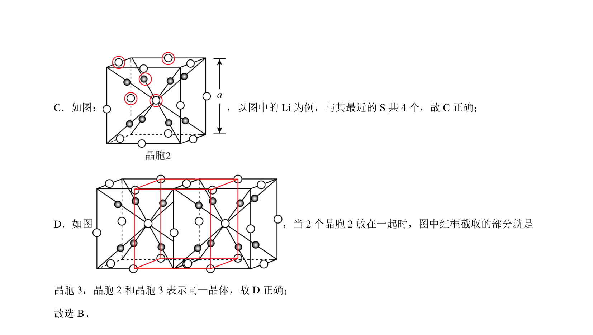

## 题面

## 摘要

该题通过晶胞结构考查均摊法计算化学式、最短距离及配位数判断。

## 关联考点

- [[881-均摊法|均摊法]]
- [[1044-空间几何|空间几何]]
- [[844-配位数计算|配位数计算]]

## 答案与解析

> 📄 原 PDF 第 10 页：`素材/真题/吉林/2008-2024·（吉林）化学高考真题/2024年高考化学试卷（辽宁）（解析卷）.pdf`

<!-- 题干文本-start -->
## 题干文本
14. 某锂离子电池电极材料结构如图。结构 1 是钴硫化物晶胞的一部分，可代表其组成和结构；晶胞 2 是
充电后的晶胞结构；所有晶胞均为立方晶胞。下列说法错误的是
A. 结构 1 钴硫化物的化学式为9 8Co SB. 晶胞 2 中 S 与 S 的最短距离为当3a2
C. 晶胞 2 中距Li最近的 S 有 4 个 D. 晶胞 2 和晶胞 3 表示同一晶体
<!-- 题干文本-end -->

<!-- 解析文本-start -->
## 解析文本
【答案】B
【解析】
【详解】A．由均摊法得，结构 1 中含有 Co的数目为14 4 4.58+ ´ =，含有 S 的数目为11+12 44´ =，Co
与 S 的原子个数比为 9：8，因此结构 1 的化学式为 Co9S8，故 A 正确；
B．由图可知，晶胞 2 中 S 与 S 的最短距离为面对角线的12，晶胞边长为 a，即 S 与 S 的最短距离为：
22a，故 B错误；
。
<!-- 解析文本-end -->
