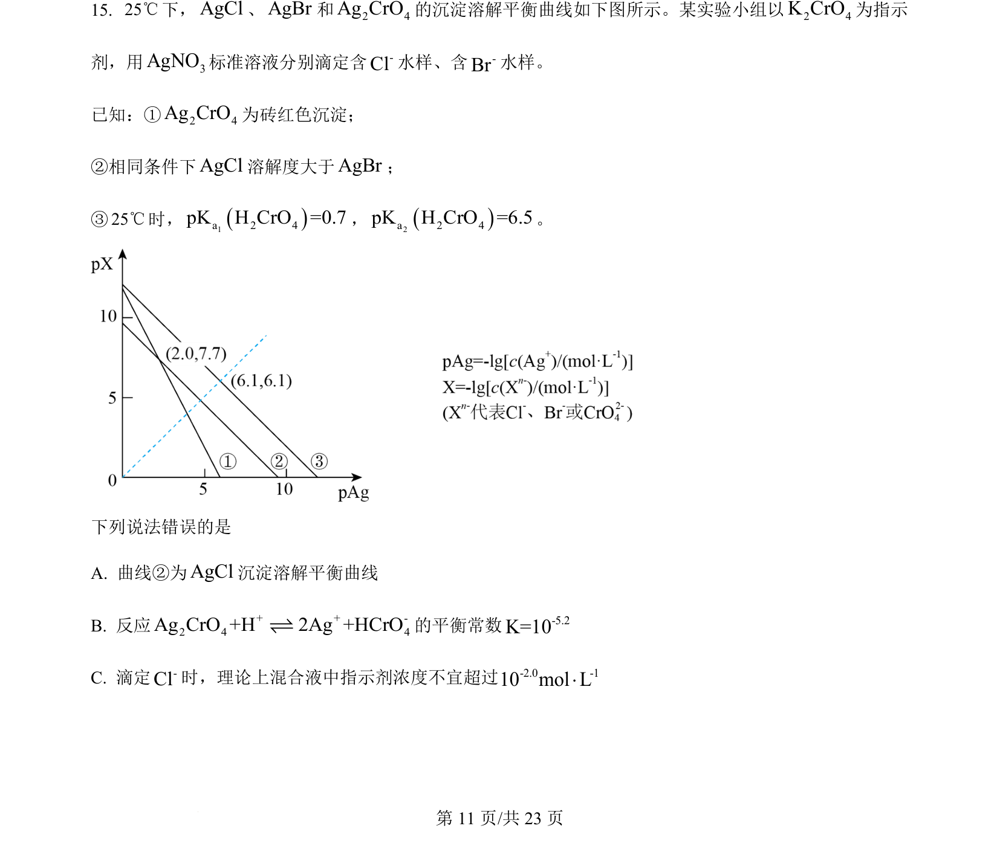
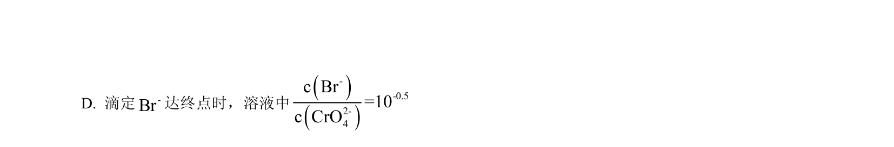
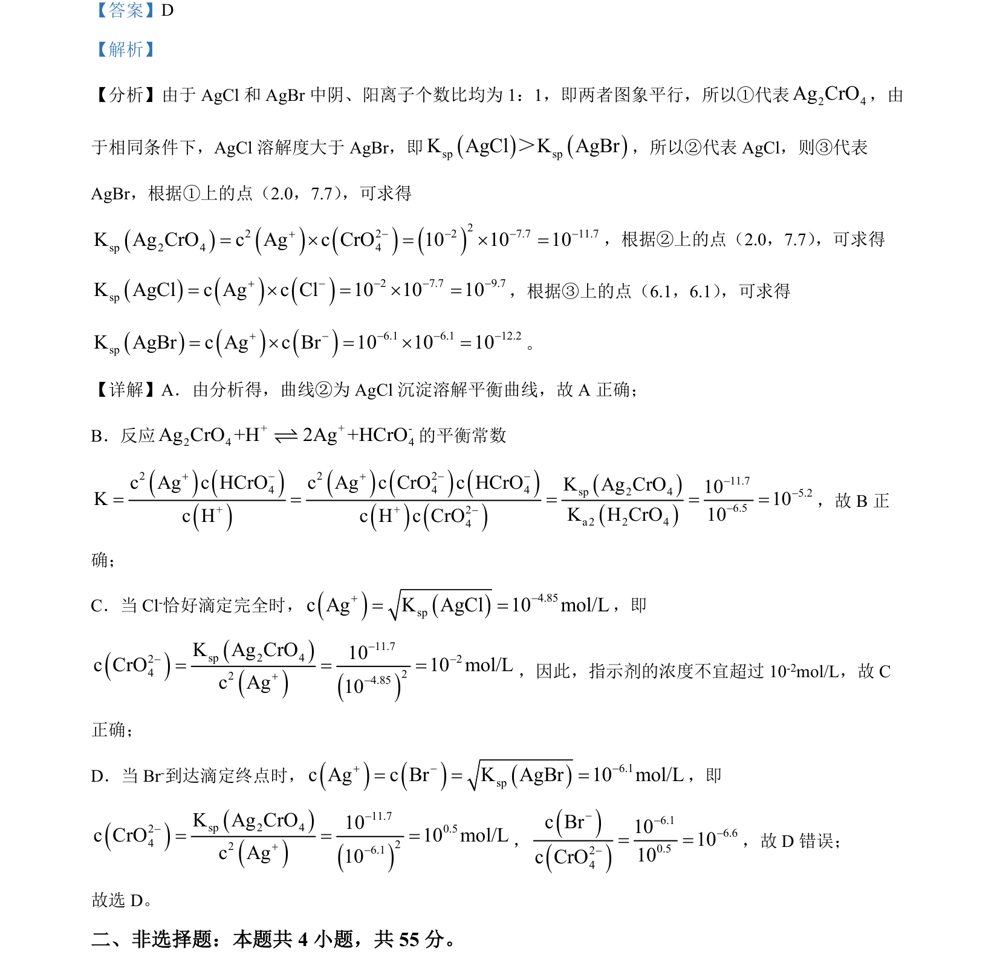

## 题面

## 摘要

通过沉淀溶解平衡图像计算并比较AgCl、AgBr、Ag₂CrO₄的Ksp。

## 关联考点

- [[328-沉淀溶解平衡|沉淀溶解平衡]]
- [[763-溶度积|溶度积常数]]
- [[564-图像分析|图像分析]]

## 答案与解析

> 📄 原 PDF 第 11 页：`素材/真题/吉林/2008-2024·（吉林）化学高考真题/2024年高考化学试卷（辽宁）（解析卷）.pdf`
