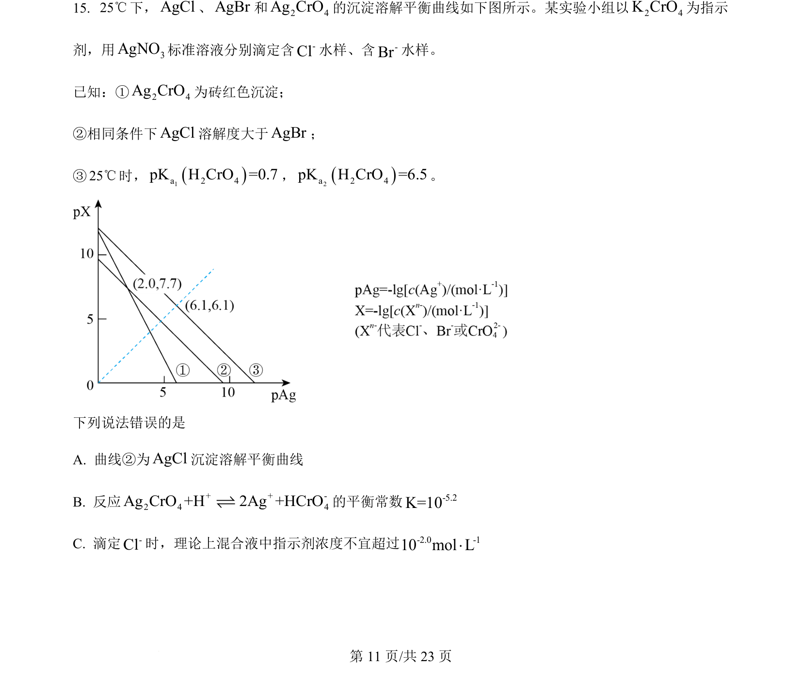
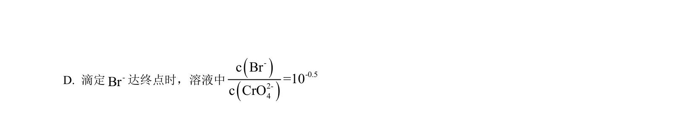
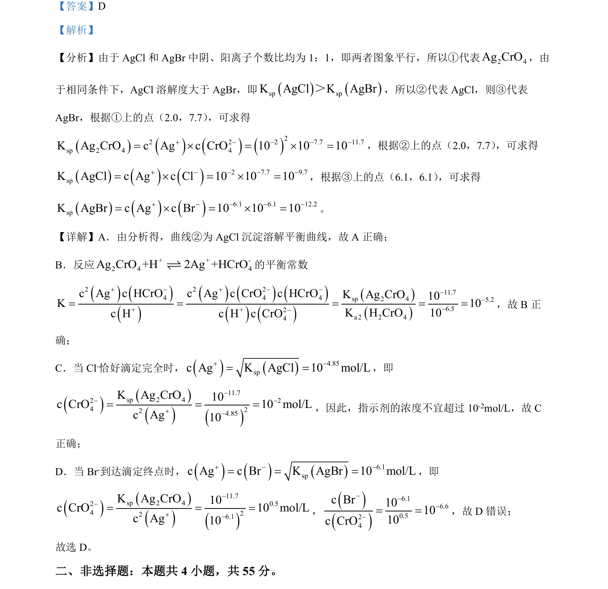

## 题面

## 摘要

通过沉淀溶解平衡图像计算并比较AgCl、AgBr、Ag₂CrO₄的Ksp。

## 关联考点

- [[328-沉淀溶解平衡|沉淀溶解平衡]]
- [[762-溶度积|溶度积常数]]
- [[564-图像分析|图像分析]]

## 答案与解析

> 📄 原 PDF 第 11 页：`素材/真题/吉林/2008-2024·（吉林）化学高考真题/2024年高考化学试卷（辽宁）（解析卷）.pdf`

<!-- 题干文本-start -->
## 题干文本
15. 25℃下，AgCl、AgBr和2 4Ag CrO的沉淀溶解平衡曲线如下图所示。某实验小组以2 4K CrO为指示
剂，用 3AgNO标准溶液分别滴定含-Cl水样、含-Br水样。
已知：①2 4Ag CrO为砖红色沉淀；
②相同条件下AgCl溶解度大于AgBr；
③25℃时，()1a 2 4pK H CrO =0.7，()2a 2 4pK H CrO =6.5。
下列说法错误的是
A. 曲线②为AgCl沉淀溶解平衡曲线
B. 反应 + + -2 4 4Ag CrO +H 2Ag +HCrOƒ的平衡常数 -5.2K=10
C. 滴定-Cl时，理论上混合液中指示剂浓度不宜超过-2.0 -110 mol L×
<!-- 题干文本-end -->

<!-- 解析文本-start -->
## 解析文本

<!-- 解析文本-end -->
