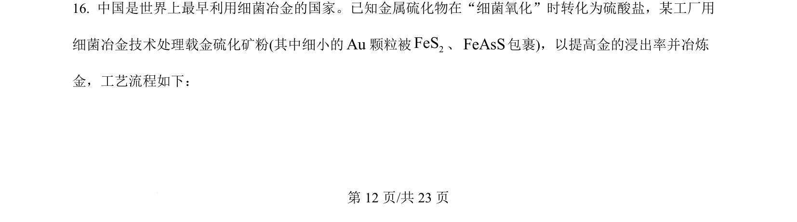
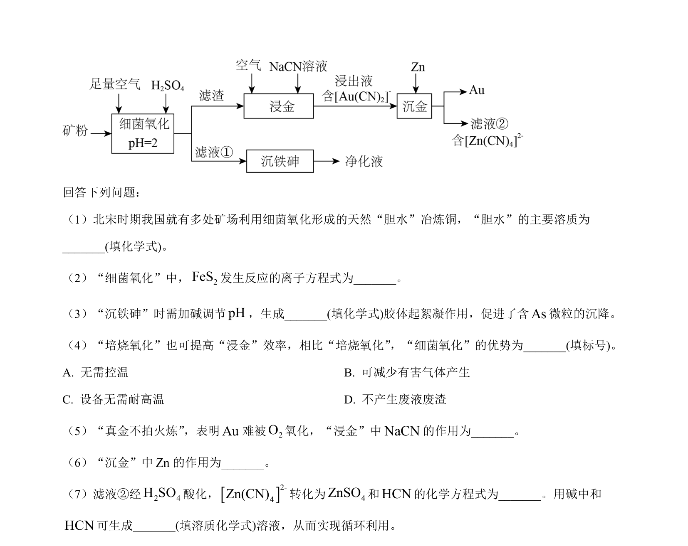
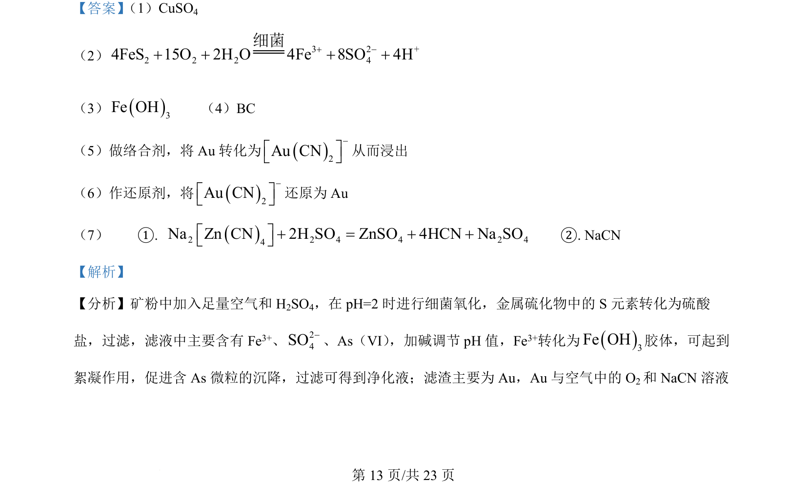
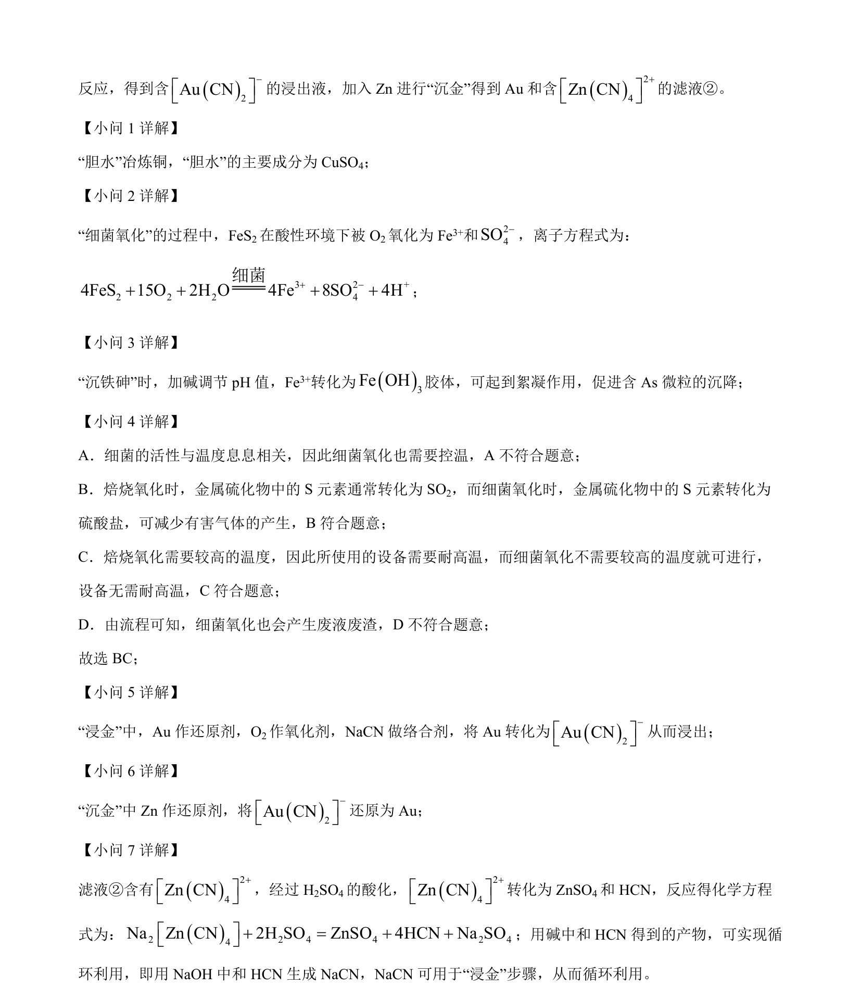

## 题面

## 摘要

该题以矿物加工流程为载体，考查铜的湿法冶炼、氧化还原离子方程式书写及胶体絮凝等原理。

## 关联考点

- [[863-铜的冶炼|铜的冶炼]]
- [[807-离子方程式的书写|离子方程式书写]]
- [[828-胶体性质|胶体性质]]
- [[875-反应条件控制|反应条件控制]]

## 答案与解析

> 📄 原 PDF 第 12 页：`素材/真题/吉林/2008-2024·（吉林）化学高考真题/2024年高考化学试卷（辽宁）（解析卷）.pdf`

<!-- 题干文本-start -->
## 题干文本
16. 中国是世界上最早利用细菌冶金的国家。已知金属硫化物在“细菌氧化”时转化为硫酸盐，某工厂用
细菌冶金技术处理载金硫化矿粉(其中细小的Au颗粒被2FeS、FeAsS包裹)，以提高金的浸出率并冶炼
金，工艺流程如下：
<!-- 题干文本-end -->

<!-- 解析文本-start -->
## 解析文本

<!-- 解析文本-end -->
