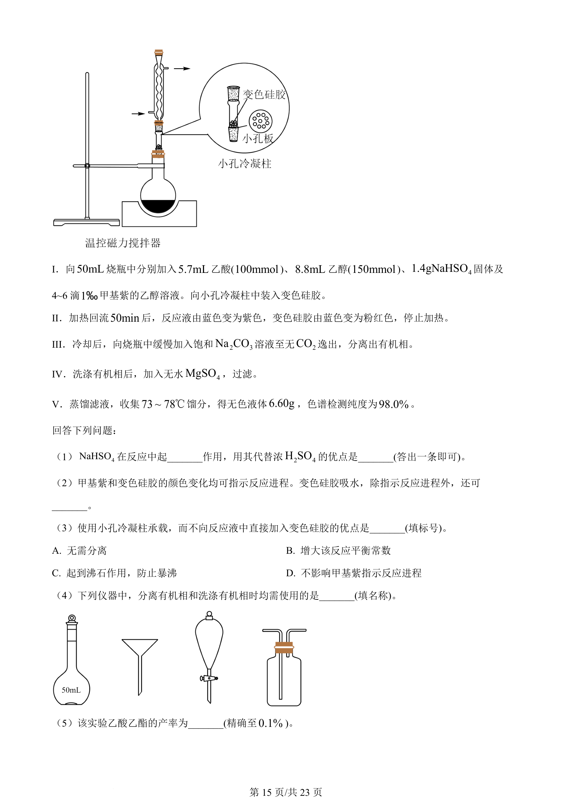
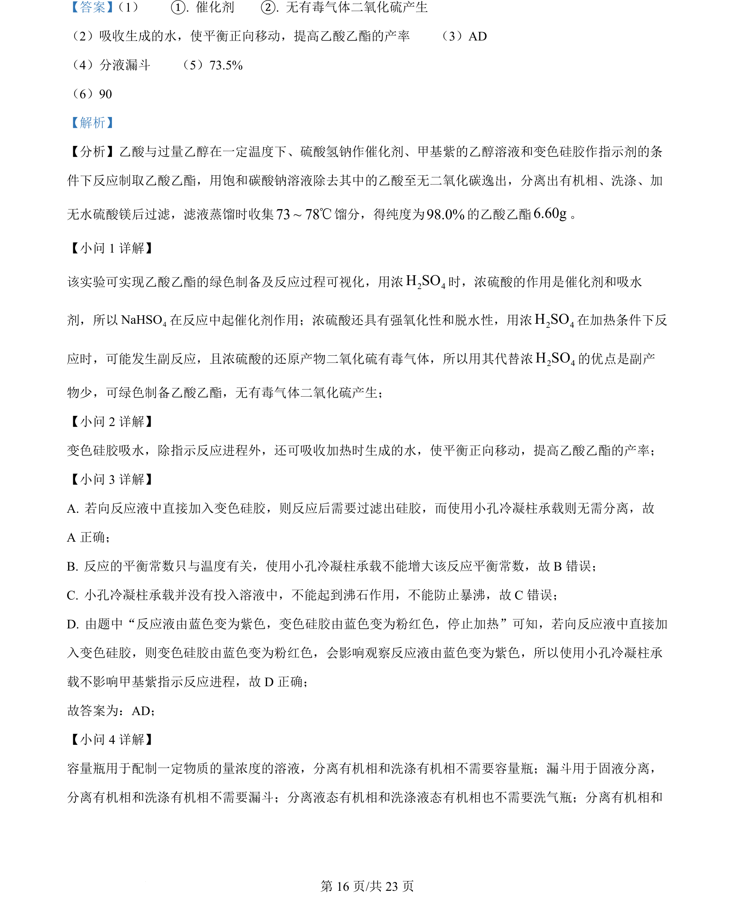
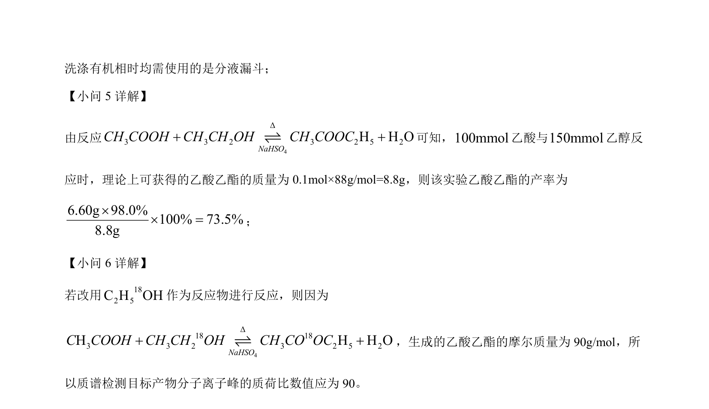

## 题面

## 摘要

乙酸乙酯的绿色制备实验，考查催化剂作用、分离提纯、产率计算及同位素示踪质谱分析

## 关联考点

- [[588-乙酸乙酯的制备|乙酸乙酯的制备]]
- [[039-催化剂|催化剂]]
- [[279-绿色化学|绿色化学]]
- [[609-分液漏斗|分液漏斗]]
- [[592-产率计算|产率计算]]
- [[850-酯化反应机理|酯化反应机理]]

## 答案与解析

> 📄 原 PDF 第 14 页：`素材/真题/吉林/2008-2024·（吉林）化学高考真题/2024年高考化学试卷（辽宁）（解析卷）.pdf`
