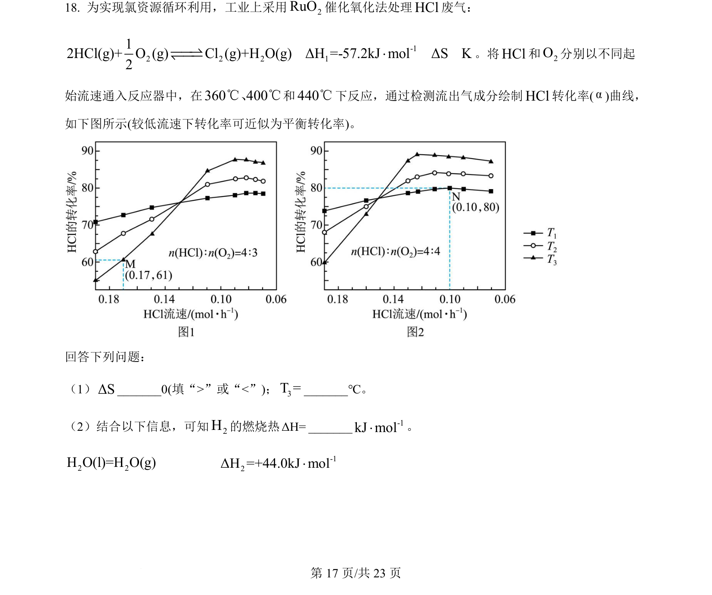
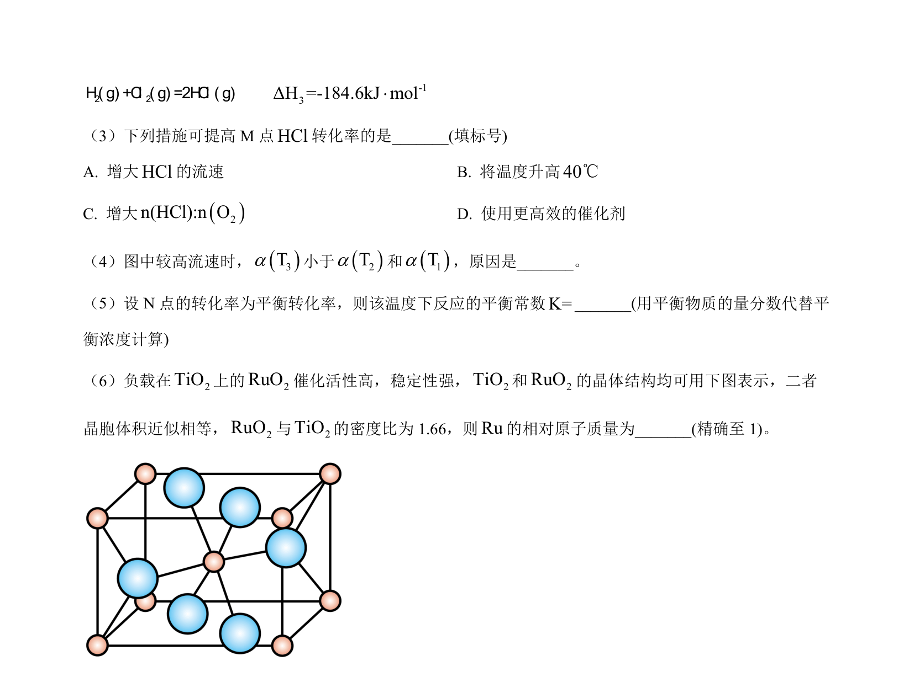
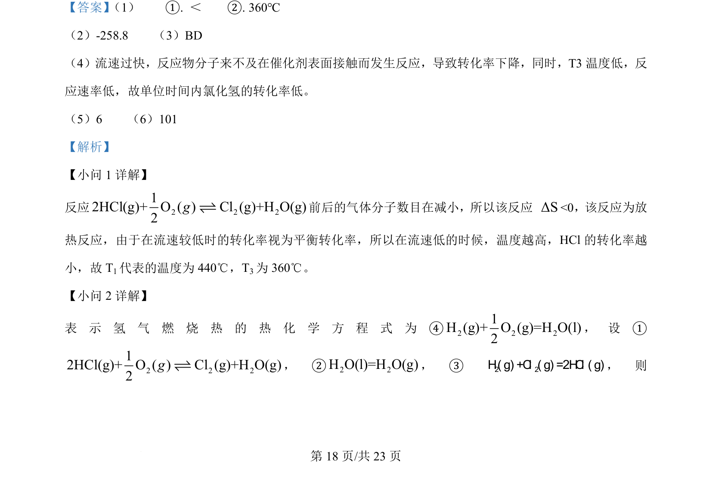
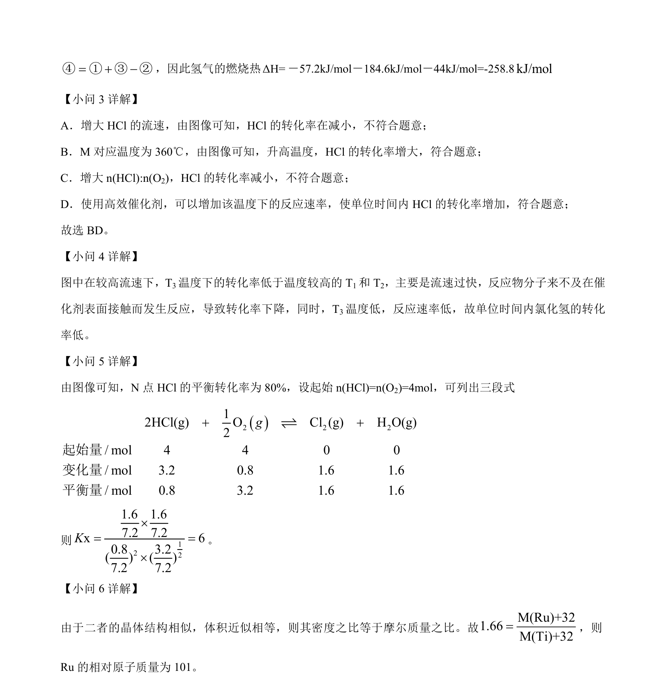

## 题面

## 摘要

本题以HCl催化氧化为背景，考查反应热计算、燃烧热概念、熵变判断及图像分析。

## 关联考点

- [[288-反应热|反应热]]
- [[155-燃料热值|燃烧热]]
- [[553-熵变|熵变]]
- [[284-化学平衡|化学平衡]]

## 答案与解析

> 📄 原 PDF 第 17 页：`素材/真题/吉林/2008-2024·（吉林）化学高考真题/2024年高考化学试卷（辽宁）（解析卷）.pdf`

<!-- 题干文本-start -->
## 题干文本
18. 为实现氯资源循环利用，工业上采用2RuO催化氧化法处理HCl废气：
-12 2 2 112HCl(g)+ O (g) Cl (g)+H O(g)ΔH =-57.2kJ molΔS K2׈ˆ †‡ˆ ˆ。将HCl和2O分别以不同起
始流速通入反应器中，在360 400℃℃、和440℃下反应，通过检测流出气成分绘制HCl转化率(α)曲线，
如下图所示(较低流速下转化率可近似为平衡转化率)。
回答下列问题：
（1）ΔS_______0(填“>”或“<”)；3T =_______℃。
（2）结合以下信息，可知2H的燃烧热ΔH=_______ -1kJ mol×。
2 2H O(l)=H O(g)           -12ΔH =+44.0kJ mol×
<!-- 题干文本-end -->

<!-- 解析文本-start -->
## 解析文本

<!-- 解析文本-end -->
