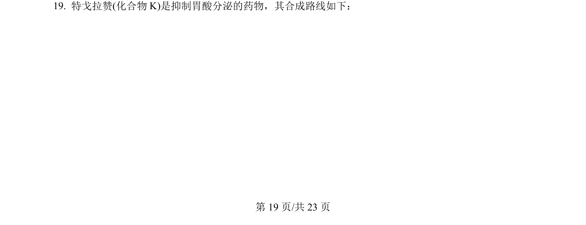
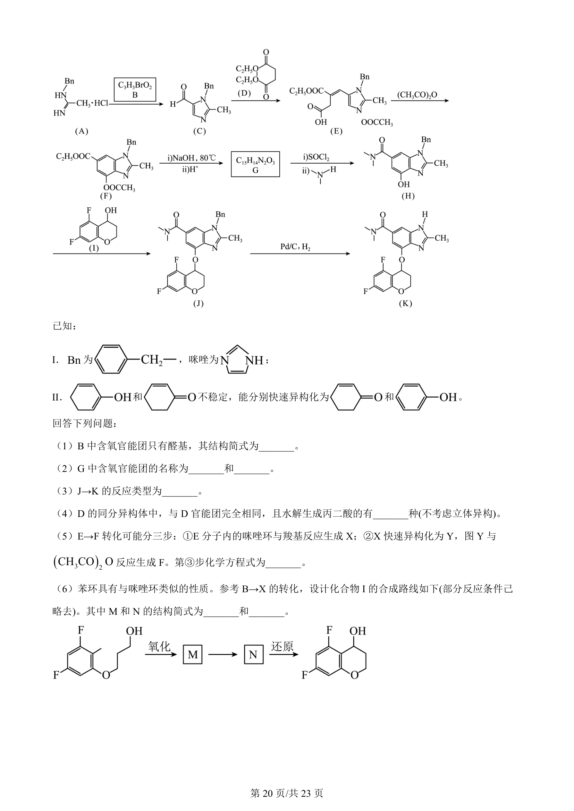
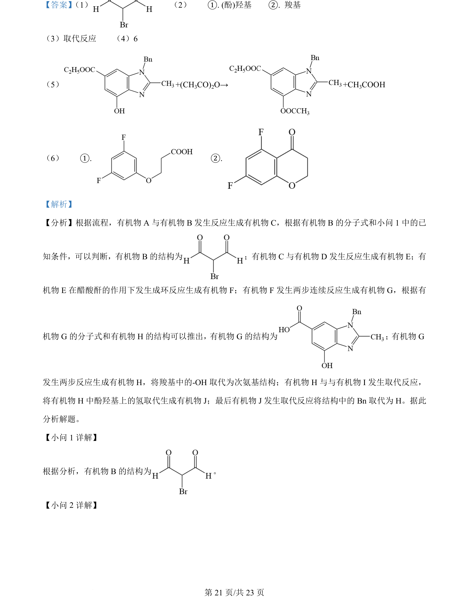
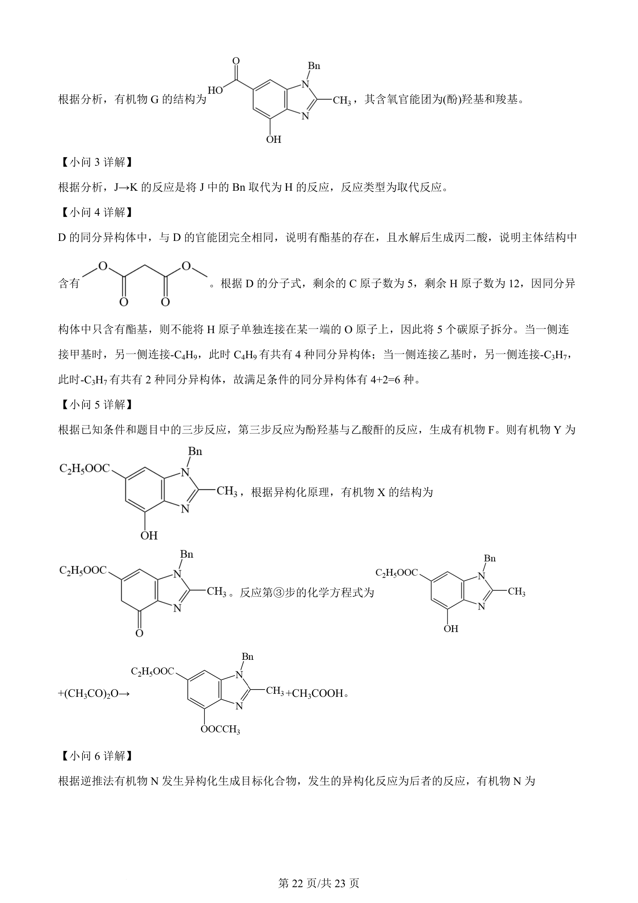
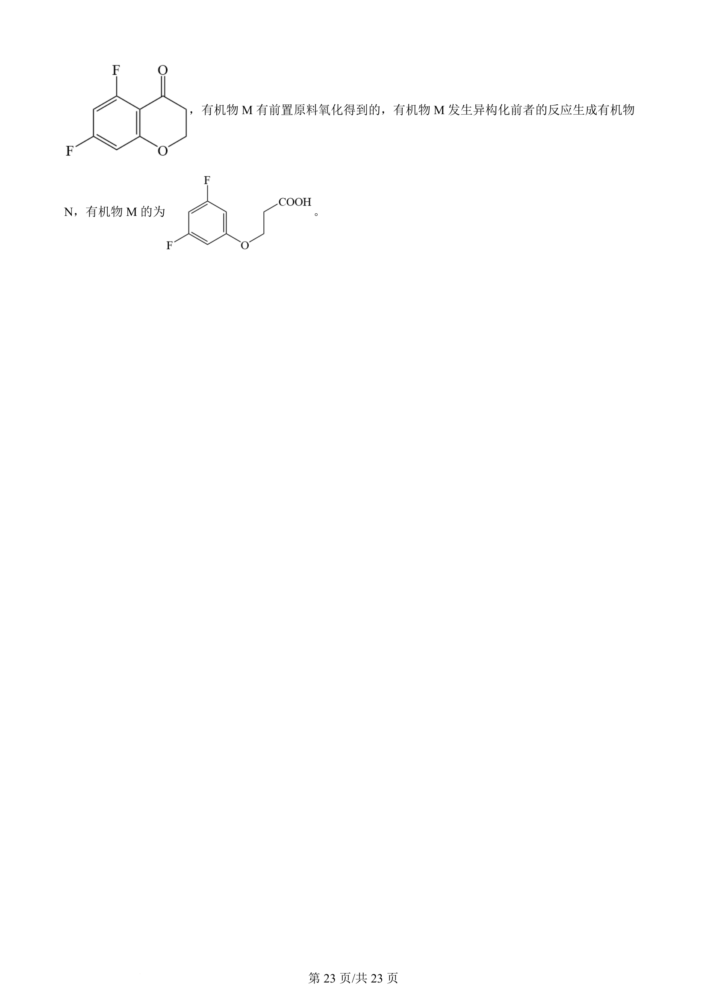

## 题面

## 摘要

有机合成路线推断，涉及结构简式、官能团、反应类型、同分异构体和方程式书写

## 关联考点

- [[271-化学合成|有机合成]]
- [[816-结构推断|结构推断]]
- [[448-官能团|官能团]]
- [[446-同分异构体|同分异构体]]

## 答案与解析

> 📄 原 PDF 第 19 页：`素材/真题/吉林/2008-2024·（吉林）化学高考真题/2024年高考化学试卷（辽宁）（解析卷）.pdf`
