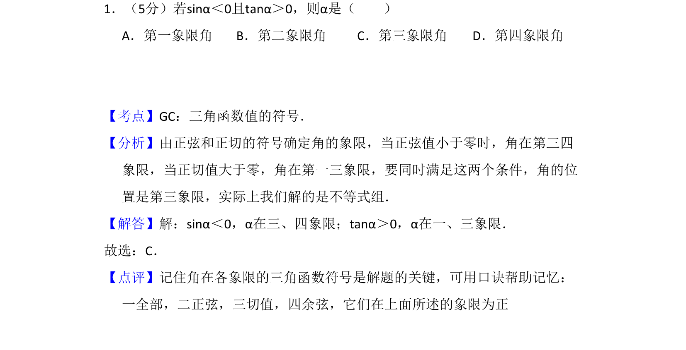
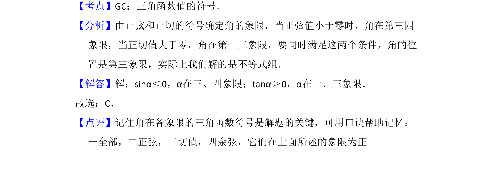

## 题面

## 摘要

已知sinα<0且tanα>0，判断角α所在象限，考查三角函数各象限符号规律。

## 关联考点

- [[270-三角函数应用|三角函数]]
- [[590-象限|象限]]

## 答案与解析

> 📄 原 PDF 第 1 页：`素材/真题/吉林/2008-2024·（吉林）数学高考真题/2008年高考数学试卷（文）（全国卷Ⅱ）（解析卷）.pdf`

<!-- 题干文本-start -->
## 题干文本
1．（5分）若sinα＜0且tanα＞0，则α是（　　）
A．第一象限角B．第二象限角C．第三象限角D．第四象限角
<!-- 题干文本-end -->

<!-- 解析文本-start -->
## 解析文本
【考点】GC：三角函数值的符号．菁优网版权所有
【分析】由正弦和正切的符号确定角的象限，当正弦值小于零时，角在第三四
象限，当正切值大于零，角在第一三象限，要同时满足这两个条件，角的位
置是第三象限，实际上我们解的是不等式组．
【解答】解：sinα＜0，α在三、四象限；tanα＞0，α在一、三象限．
故选：C．
【点评】记住角在各象限的三角函数符号是解题的关键，可用口诀帮助记忆：
一全部，二正弦，三切值，四余弦，它们在上面所述的象限为正
<!-- 解析文本-end -->
