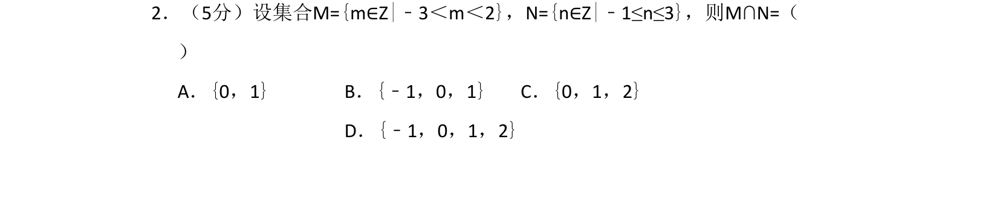
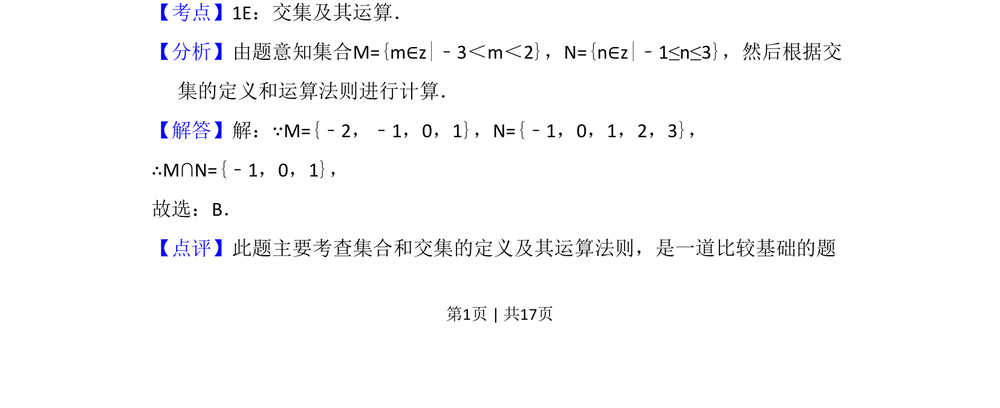

## 题面

## 摘要

整数集合M={m∈Z|-3<m<2}与N={n∈Z|-1≤n≤3}的交集运算，考查集合交集定义。

## 关联考点

- [[042-集合|集合]]
- [[1222-交集|交集]]

## 答案与解析

> 📄 原 PDF 第 1 页：`素材/真题/吉林/2008-2024·（吉林）数学高考真题/2008年高考数学试卷（文）（全国卷Ⅱ）（解析卷）.pdf`

<!-- 题干文本-start -->
## 题干文本
2．（5分）设集合M={m∈Z|﹣3＜m＜2}，N={n∈Z|﹣1≤n≤3}，则M∩N=（　　
）
A．{0，1}B．{﹣1，0，1}C．{0，1，2}
D．{﹣1，0，1，2}
<!-- 题干文本-end -->

<!-- 解析文本-start -->
## 解析文本
【考点】1E：交集及其运算．菁优网版权所有
【分析】由题意知集合M={m∈z|﹣3＜m＜2}，N={n∈z|﹣1≤n≤3}，然后根据交
集的定义和运算法则进行计算．
【解答】解：∵M={﹣2，﹣1，0，1}，N={﹣1，0，1，2，3}，
∴M∩N={﹣1，0，1}，
故选：B．
【点评】此题主要考查集合和交集的定义及其运算法则，是一道比较基础的题
<!-- 解析文本-end -->
