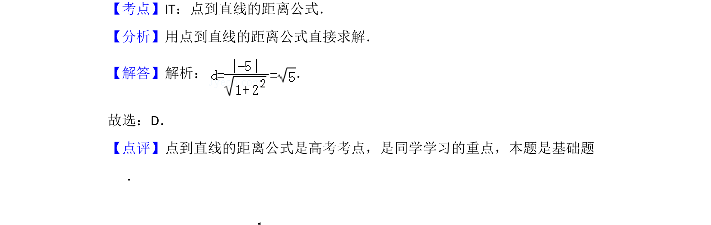

## 题面

## 摘要

用点到直线距离公式求原点到直线x+2y-5=0的距离，直接套公式计算。

## 关联考点

- [[1111-解析几何|解析几何]]
- [[1211-点到直线距离|点到直线距离]]

## 答案与解析

> 📄 原 PDF 第 2 页：`素材/真题/吉林/2008-2024·（吉林）数学高考真题/2008年高考数学试卷（文）（全国卷Ⅱ）（解析卷）.pdf`

<!-- 题干文本-start -->
## 题干文本
3．（5分）原点到直线x+2y﹣5=0的距离为（　　）
A．1 B．C．2 D．
<!-- 题干文本-end -->

<!-- 解析文本-start -->
## 解析文本
【考点】IT：点到直线的距离公式．菁优网版权所有
【分析】用点到直线的距离公式直接求解．
【解答】解析： ．
故选：D．
【点评】点到直线的距离公式是高考考点，是同学学习的重点，本题是基础题
．
<!-- 解析文本-end -->
