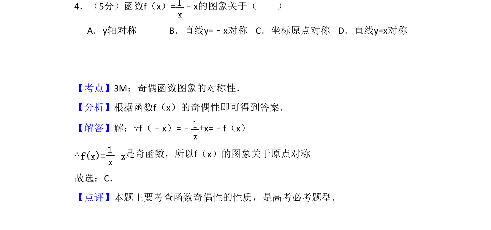
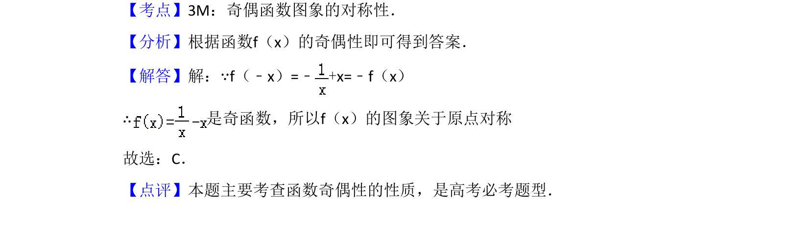

## 题面

## 摘要

判断函数f(x)=1/x-x的奇偶性，利用f(-x)=-f(x)得出图象关于原点对称。

## 关联考点

- [[284-函数的奇偶性|奇函数]]
- [[771-图象对称性|图象对称性]]
- [[679-函数奇偶性|函数奇偶性]]

## 答案与解析

> 📄 原 PDF 第 2 页：`素材/真题/吉林/2008-2024·（吉林）数学高考真题/2008年高考数学试卷（文）（全国卷Ⅱ）（解析卷）.pdf`
