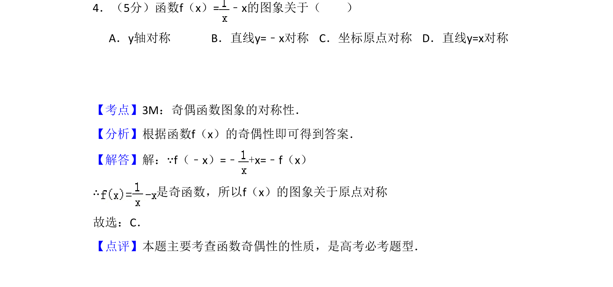
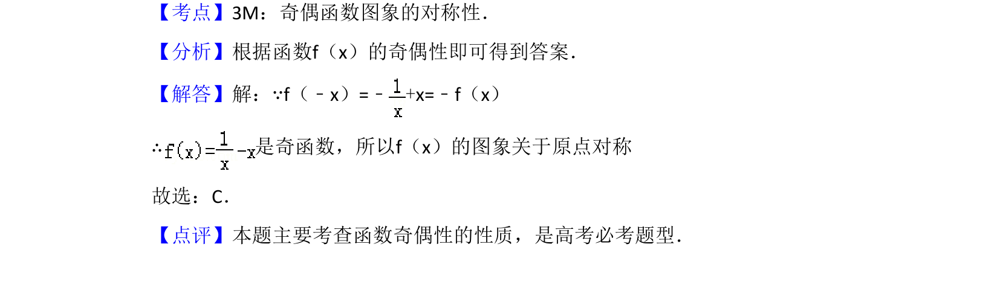

## 题面

## 摘要

判断函数f(x)=1/x-x的奇偶性，利用f(-x)=-f(x)得出图象关于原点对称。

## 关联考点

- [[284-函数的奇偶性|奇函数]]
- [[771-图象对称性|图象对称性]]
- [[284-函数的奇偶性|函数奇偶性]]

## 答案与解析

> 📄 原 PDF 第 2 页：`素材/真题/吉林/2008-2024·（吉林）数学高考真题/2008年高考数学试卷（文）（全国卷Ⅱ）（解析卷）.pdf`

<!-- 题干文本-start -->
## 题干文本
4．（5分）函数f（x）=﹣x的图象关于（　　）
A．y轴对称B．直线y=﹣x对称C．坐标原点对称D．直线y=x对称
<!-- 题干文本-end -->

<!-- 解析文本-start -->
## 解析文本
【考点】3M：奇偶函数图象的对称性．菁优网版权所有
【分析】根据函数f（x）的奇偶性即可得到答案．
【解答】解：∵f（﹣x）=﹣+x=﹣f（x）
∴是奇函数，所以f（x）的图象关于原点对称
故选：C．
【点评】本题主要考查函数奇偶性的性质，是高考必考题型．
<!-- 解析文本-end -->
