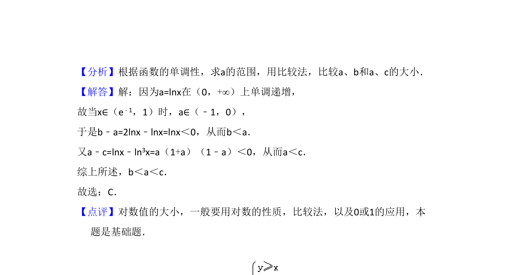

## 题面

## 摘要

当x∈(e⁻¹,1)时比较lnx、2lnx、ln³x三个对数值的大小，考查对数函数单调性。

## 关联考点

- [[188-函数概念|函数]]
- [[300-对数概念|对数]]
- [[083-不等式|不等式]]

## 答案与解析

> 📄 原 PDF 第 2 页：`素材/真题/吉林/2008-2024·（吉林）数学高考真题/2008年高考数学试卷（文）（全国卷Ⅱ）（解析卷）.pdf`
