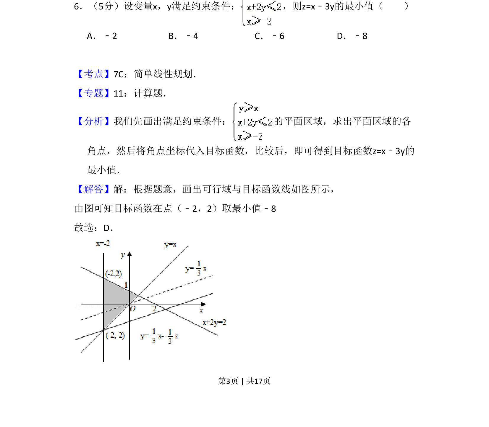

## 题面

## 摘要

本题考查线性规划中目标函数的最小值问题，通过作出可行域并计算角点比较得到。

## 关联考点

- [[简单线性规划]]
- [[可行域]]
- [[目标函数]]
- [[286-函数的最值|最值]]

## 答案与解析

> 📄 原 PDF 第 3 页：`素材/真题/吉林/2008-2024·（吉林）数学高考真题/2008年高考数学试卷（文）（全国卷Ⅱ）（解析卷）.pdf`
