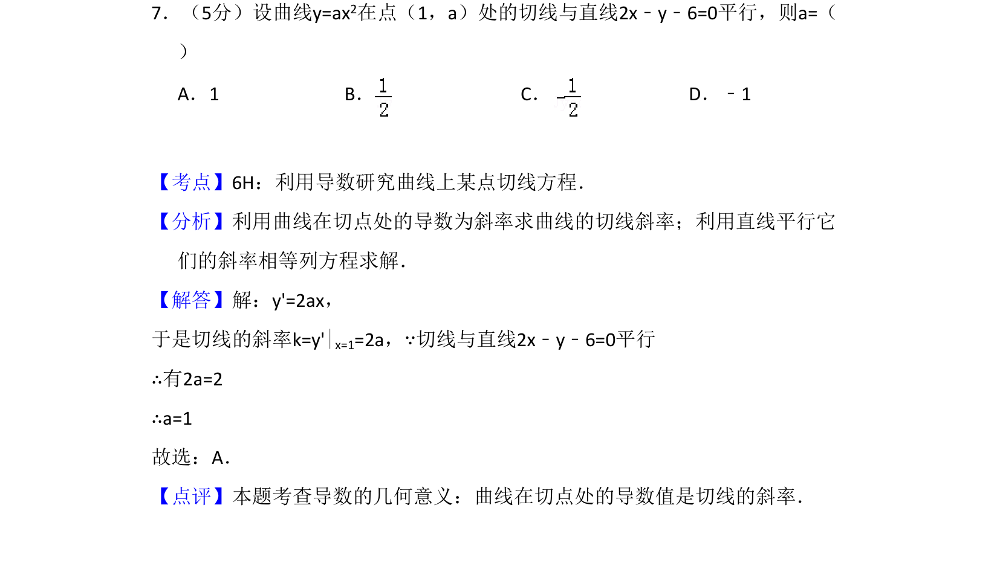

## 题面

## 摘要

利用导数求曲线切线斜率，结合直线平行条件求解参数。

## 关联考点

- [[440-导数的几何意义|导数的几何意义]]
- [[440-导数的几何意义|切线斜率]]
- [[直线平行]]

## 答案与解析

> 📄 原 PDF 第 4 页：`素材/真题/吉林/2008-2024·（吉林）数学高考真题/2008年高考数学试卷（文）（全国卷Ⅱ）（解析卷）.pdf`
