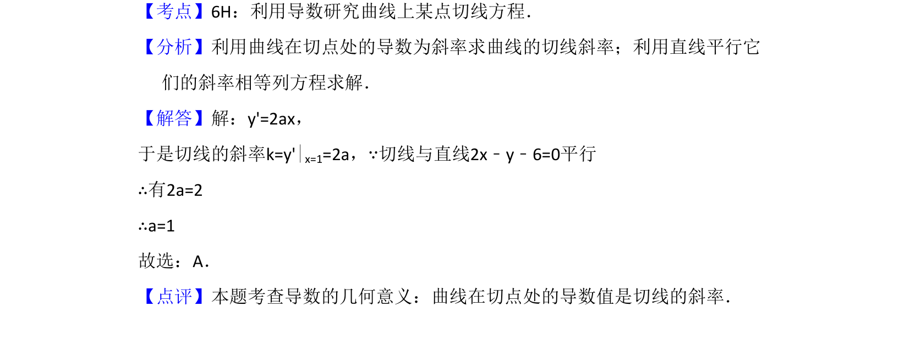

## 题面

## 摘要

曲线y=ax²在点(1,a)处切线与直线2x-y-6=0平行，利用导数等于斜率求参数a。

## 关联考点

- [[425-反函数导数|导数]]
- [[217-切线|切线]]

## 答案与解析

> 📄 原 PDF 第 4 页：`素材/真题/吉林/2008-2024·（吉林）数学高考真题/2008年高考数学试卷（文）（全国卷Ⅱ）（解析卷）.pdf`

<!-- 题干文本-start -->
## 题干文本
7．（5分）设曲线y=ax2在点（1，a）处的切线与直线2x﹣y﹣6=0平行，则a=（　　
）
A．1 B．C．D．﹣1
<!-- 题干文本-end -->

<!-- 解析文本-start -->
## 解析文本
【考点】6H：利用导数研究曲线上某点切线方程．菁优网版权所有
【分析】利用曲线在切点处的导数为斜率求曲线的切线斜率；利用直线平行它
们的斜率相等列方程求解．
【解答】解：y'=2ax，
于是切线的斜率k=y'|x=1=2a，∵切线与直线2x﹣y﹣6=0平行
∴有2a=2
∴a=1
故选：A．
【点评】本题考查导数的几何意义：曲线在切点处的导数值是切线的斜率．
<!-- 解析文本-end -->
