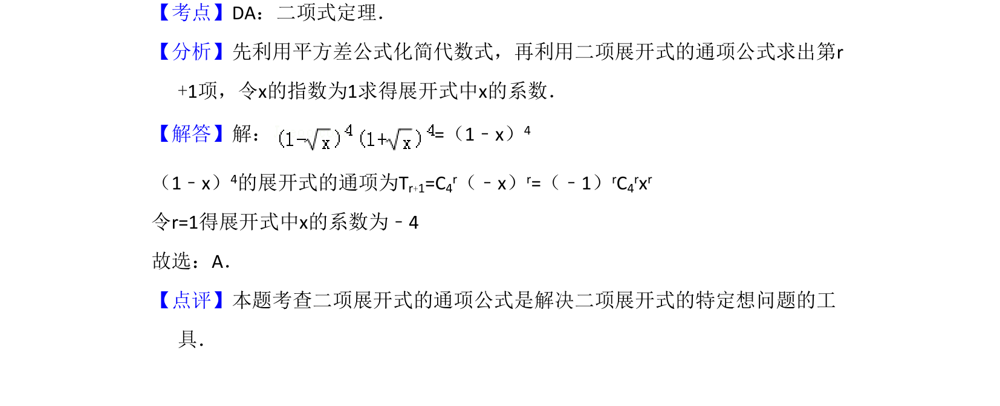

## 题面

## 摘要

利用平方差公式化简(1-√x)⁴(1+√x)⁴=(1-x)⁴，再用二项展开式通项求x的系数。

## 关联考点

- [[472-二项式定理|二项式定理]]
- [[166-平方差公式|平方差公式]]
- [[1161-展开式通项|展开式通项]]

## 答案与解析

> 📄 原 PDF 第 5 页：`素材/真题/吉林/2008-2024·（吉林）数学高考真题/2008年高考数学试卷（文）（全国卷Ⅱ）（解析卷）.pdf`
