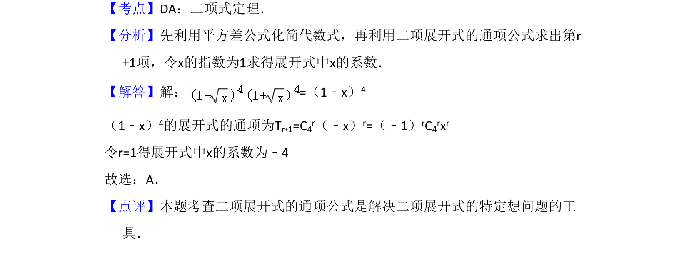

## 题面

## 摘要

利用平方差公式化简(1-√x)⁴(1+√x)⁴=(1-x)⁴，再用二项展开式通项求x的系数。

## 关联考点

- [[472-二项式定理|二项式定理]]
- [[166-平方差公式|平方差公式]]
- [[1160-展开式通项|展开式通项]]

## 答案与解析

> 📄 原 PDF 第 5 页：`素材/真题/吉林/2008-2024·（吉林）数学高考真题/2008年高考数学试卷（文）（全国卷Ⅱ）（解析卷）.pdf`

<!-- 题干文本-start -->
## 题干文本
9．（5分） 的展开式中x的系数是（　　）
A．﹣4 B．﹣3 C．3 D．4
<!-- 题干文本-end -->

<!-- 解析文本-start -->
## 解析文本
【考点】DA：二项式定理．菁优网版权所有
【分析】先利用平方差公式化简代数式，再利用二项展开式的通项公式求出第r
+1项，令x的指数为1求得展开式中x的系数．
【解答】解：=（1﹣x） 4
（1﹣x）4的展开式的通项为Tr+1=C4r（﹣x）r=（﹣1）rC4rxr
令r=1得展开式中x的系数为﹣4
故选：A．
【点评】本题考查二项展开式的通项公式是解决二项展开式的特定想问题的工
具．
<!-- 解析文本-end -->
