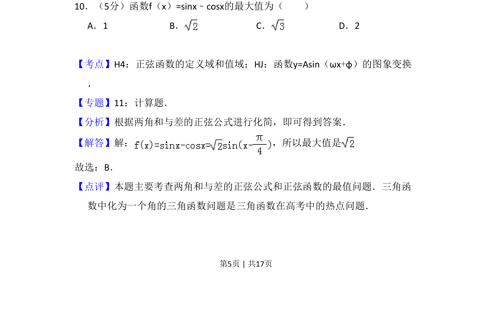
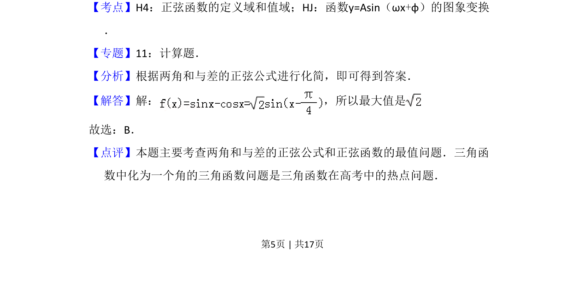

## 题面

## 摘要

求f(x)=sinx-cosx的最大值，利用辅助角公式化为√2sin(x-π/4)求最大值√2。

## 关联考点

- [[270-三角函数应用|三角函数]]
- [[1126-辅助角公式|辅助角公式]]

## 答案与解析

> 📄 原 PDF 第 5 页：`素材/真题/吉林/2008-2024·（吉林）数学高考真题/2008年高考数学试卷（文）（全国卷Ⅱ）（解析卷）.pdf`
