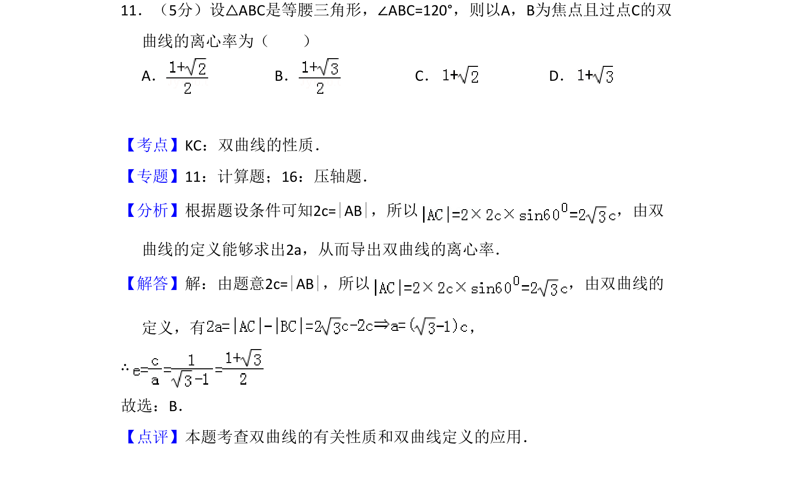
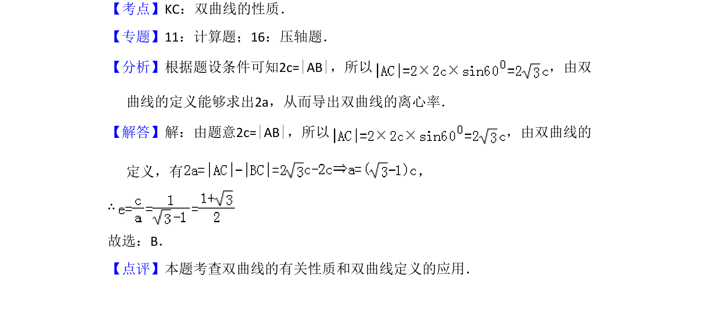

## 题面

## 摘要

等腰三角形ABC中∠ABC=120°，以A、B为焦点过顶点C的双曲线离心率，综合三角与双曲线定义。

## 关联考点

- [[1111-解析几何|解析几何]]
- [[368-双曲线定义与方程|双曲线]]
- [[270-三角函数应用|三角函数]]

## 答案与解析

> 📄 原 PDF 第 6 页：`素材/真题/吉林/2008-2024·（吉林）数学高考真题/2008年高考数学试卷（文）（全国卷Ⅱ）（解析卷）.pdf`

<!-- 题干文本-start -->
## 题干文本
11．（5分）设△ABC是等腰三角形，∠ABC=120°，则以A，B为焦点且过点C的双
曲线的离心率为（　　）
A．B．C．D．
<!-- 题干文本-end -->

<!-- 解析文本-start -->
## 解析文本
【考点】KC：双曲线的性质．菁优网版权所有
【专题】11：计算题；16：压轴题．
【分析】根据题设条件可知2c=|AB|，所以 ，由双
曲线的定义能够求出2a，从而导出双曲线的离心率．
【解答】解：由题意2c=|AB|，所以 ，由双曲线的
定义，有 ，
∴
故选：B．
【点评】本题考查双曲线的有关性质和双曲线定义的应用．
<!-- 解析文本-end -->
