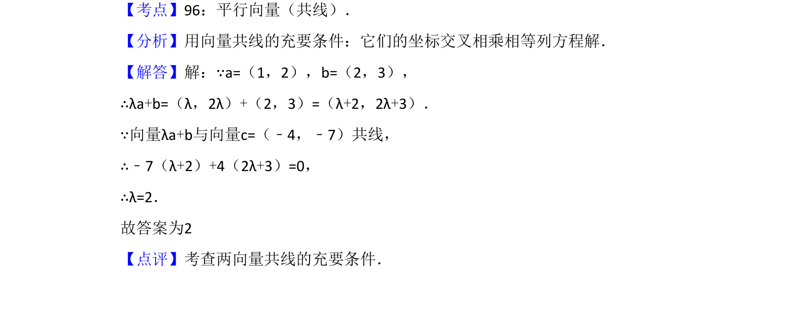

## 题面

## 摘要

向量a=(1,2)、b=(2,3)，向量λa+b与c=(-4,-7)共线，用坐标交叉相乘法求λ。

## 关联考点

- [[329-向量的概念|向量]]
- [[1209-共线条件|共线条件]]

## 答案与解析

> 📄 原 PDF 第 7 页：`素材/真题/吉林/2008-2024·（吉林）数学高考真题/2008年高考数学试卷（文）（全国卷Ⅱ）（解析卷）.pdf`

<!-- 题干文本-start -->
## 题干文本
13．（5分）设向量 ，若向量 与向量 共
线，则λ=　2　．
<!-- 题干文本-end -->

<!-- 解析文本-start -->
## 解析文本
【考点】96：平行向量（共线）．菁优网版权所有
【分析】用向量共线的充要条件：它们的坐标交叉相乘相等列方程解．
【解答】解：∵a=（1，2），b=（2，3），
∴λa+b=（λ，2λ）+（2，3）=（λ+2，2λ+3）．
∵向量λa+b与向量c=（﹣4，﹣7）共线，
∴﹣7（λ+2）+4（2λ+3）=0，
∴λ=2．
故答案为2
【点评】考查两向量共线的充要条件．
<!-- 解析文本-end -->
