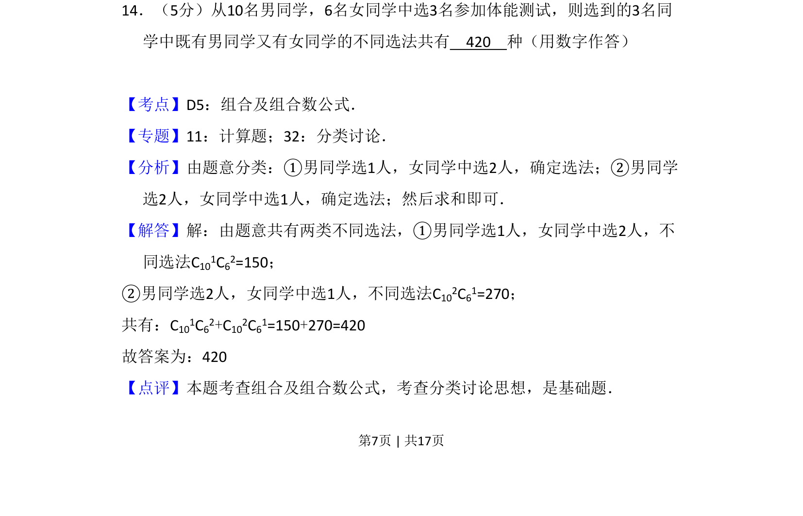
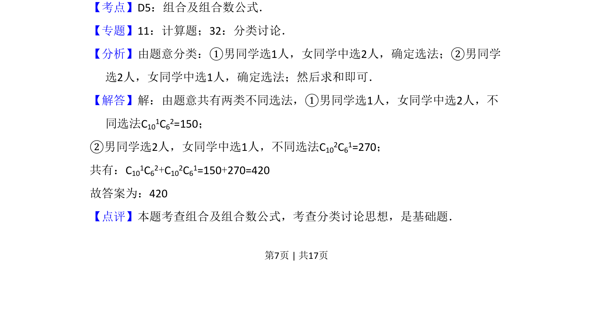

## 题面

## 摘要

从10名男生6名女生中选3人参加体能测试，要求既有男又有女，用分类加法计算组合数。

## 关联考点

- [[031-搭配|排列组合]]
- [[504-组合数公式|组合数]]
- [[1112-计数原理|计数原理]]

## 答案与解析

> 📄 原 PDF 第 7 页：`素材/真题/吉林/2008-2024·（吉林）数学高考真题/2008年高考数学试卷（文）（全国卷Ⅱ）（解析卷）.pdf`

<!-- 题干文本-start -->
## 题干文本
14．（5分）从10名男同学，6名女同学中选3名参加体能测试，则选到的3名同
学中既有男同学又有女同学的不同选法共有　420　种（用数字作答）
<!-- 题干文本-end -->

<!-- 解析文本-start -->
## 解析文本
【考点】D5：组合及组合数公式．菁优网版权所有
【专题】11：计算题；32：分类讨论．
【分析】由题意分类：①男同学选1人，女同学中选2人，确定选法；②男同学
选2人，女同学中选1人，确定选法；然后求和即可．
【解答】解：由题意共有两类不同选法，①男同学选1人，女同学中选2人，不
同选法C101C62=150；
②男同学选2人，女同学中选1人，不同选法C102C61=270；
共有：C101C62+C102C61=150+270=420
故答案为：420
【点评】本题考查组合及组合数公式，考查分类讨论思想，是基础题．
<!-- 解析文本-end -->
