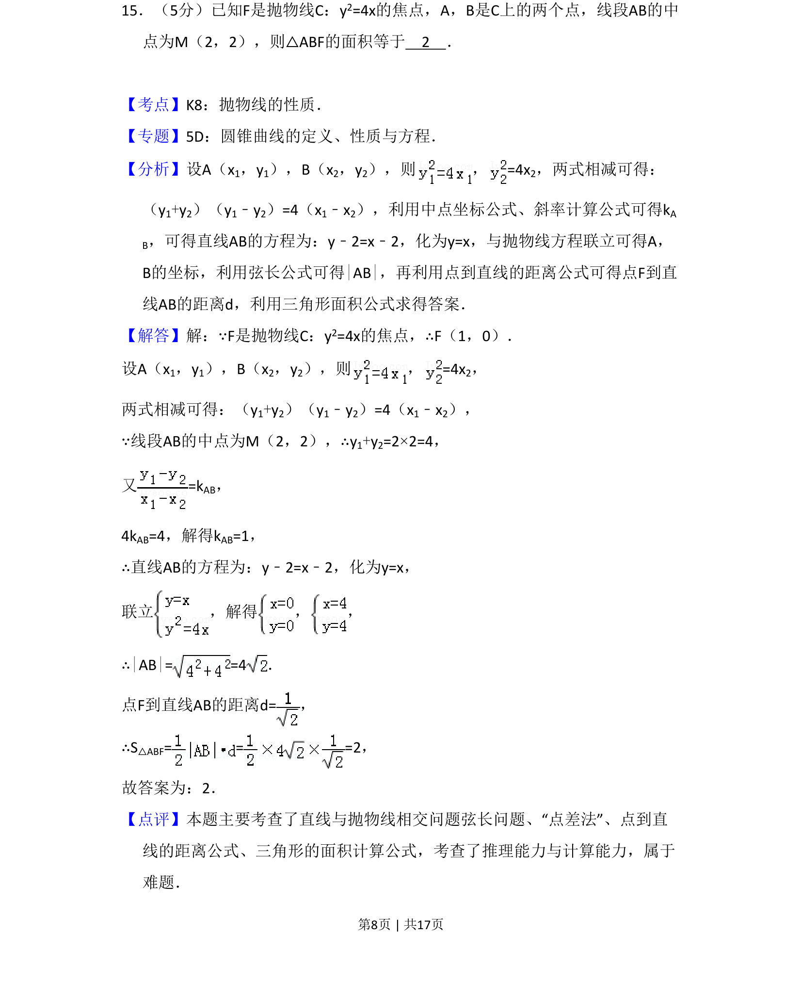
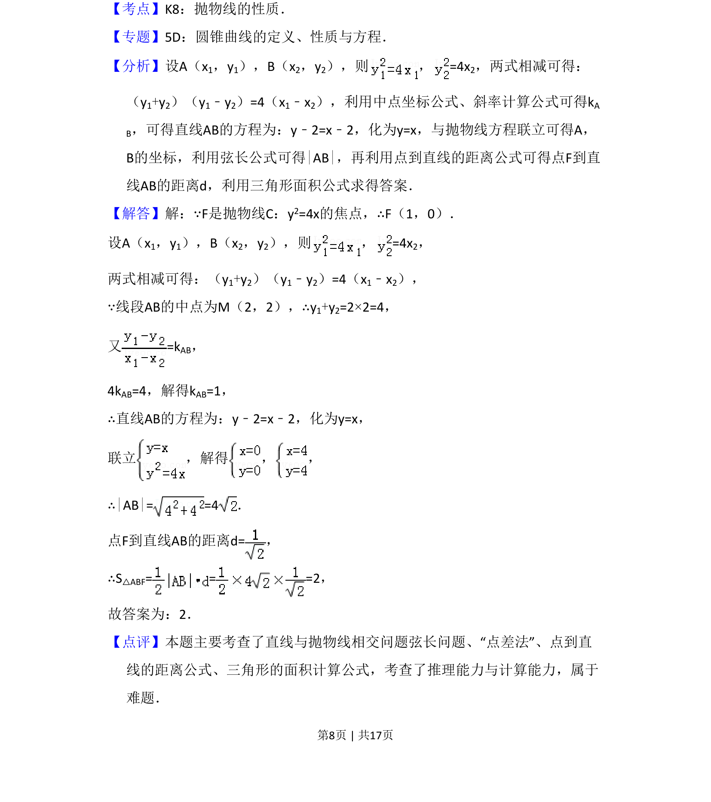

## 题面

## 摘要

抛物线y²=4x焦点为F，A、B是抛物线上两点且线段AB中点为M(2,2)，求△ABF面积。

## 关联考点

- [[1111-解析几何|解析几何]]
- [[227-抛物线|抛物线]]

## 答案与解析

> 📄 原 PDF 第 8 页：`素材/真题/吉林/2008-2024·（吉林）数学高考真题/2008年高考数学试卷（文）（全国卷Ⅱ）（解析卷）.pdf`

<!-- 题干文本-start -->
## 题干文本
15．（5分）已知F是抛物线C：y2=4x的焦点，A，B是C上的两个点，线段AB的中
点为M（2，2），则△ABF的面积等于　2　．
<!-- 题干文本-end -->

<!-- 解析文本-start -->
## 解析文本
【考点】K8：抛物线的性质．菁优网版权所有
【专题】5D：圆锥曲线的定义、性质与方程．
【分析】设A（x1，y1），B（x2，y2），则 ，=4x 2，两式相减可得：
（y1+y2）（y1﹣y2）=4（x1﹣x2），利用中点坐标公式、斜率计算公式可得kA
B，可得直线AB的方程为：y﹣2=x﹣2，化为y=x，与抛物线方程联立可得A，
B的坐标，利用弦长公式可得|AB|，再利用点到直线的距离公式可得点F到直
线AB的距离d，利用三角形面积公式求得答案．
【解答】解：∵F是抛物线C：y2=4x的焦点，∴F（1，0）．
设A（x1，y1），B（x2，y2），则 ，=4x 2，
两式相减可得：（y1+y2）（y1﹣y2）=4（x1﹣x2），
∵线段AB的中点为M（2，2），∴y1+y2=2×2=4，
又=k AB，
4kAB=4，解得kAB=1，
∴直线AB的方程为：y﹣2=x﹣2，化为y=x，
联立 ，解得 ， ，
∴|AB|= =4．
点F到直线AB的距离d=，
∴S△ABF= = =2，
故答案为：2．
【点评】本题主要考查了直线与抛物线相交问题弦长问题、“点差法”、点到直
线的距离公式、三角形的面积计算公式，考查了推理能力与计算能力，属于
难题．
<!-- 解析文本-end -->
