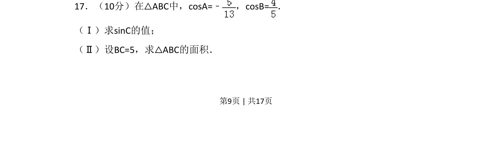
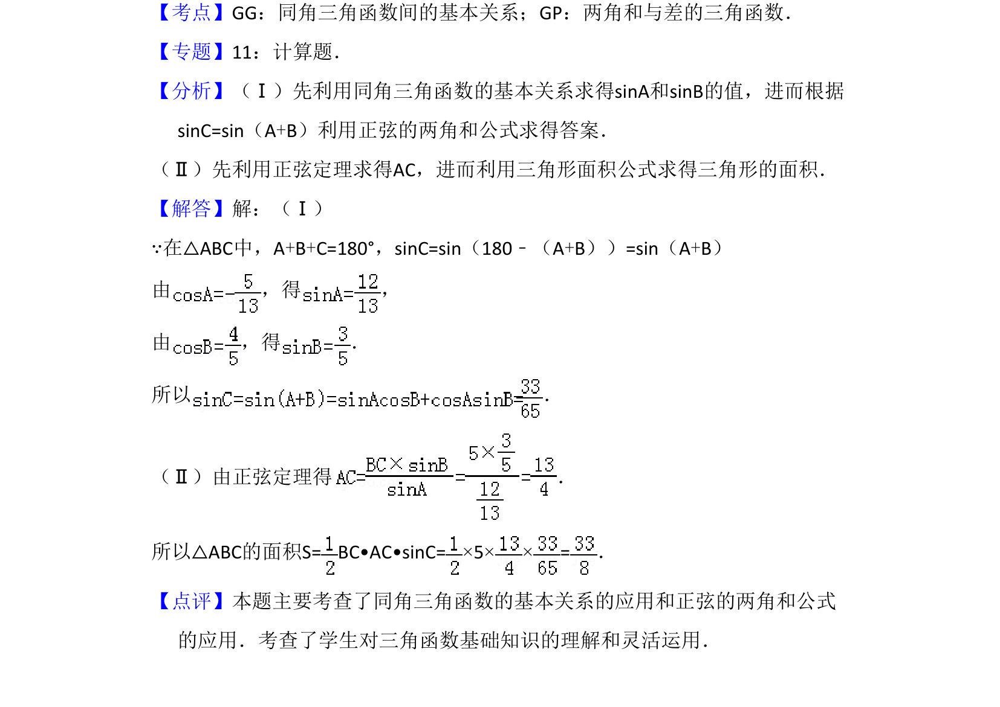

## 题面

## 摘要

△ABC中cosA=-5/13、cosB=4/5，利用两角和公式求sinC，再由正弦定理求BC=5时三角形面积。

## 关联考点

- [[270-三角函数应用|三角函数]]
- [[955-正余弦定理|正余弦定理]]

## 答案与解析

> 📄 原 PDF 第 9 页：`素材/真题/吉林/2008-2024·（吉林）数学高考真题/2008年高考数学试卷（文）（全国卷Ⅱ）（解析卷）.pdf`
