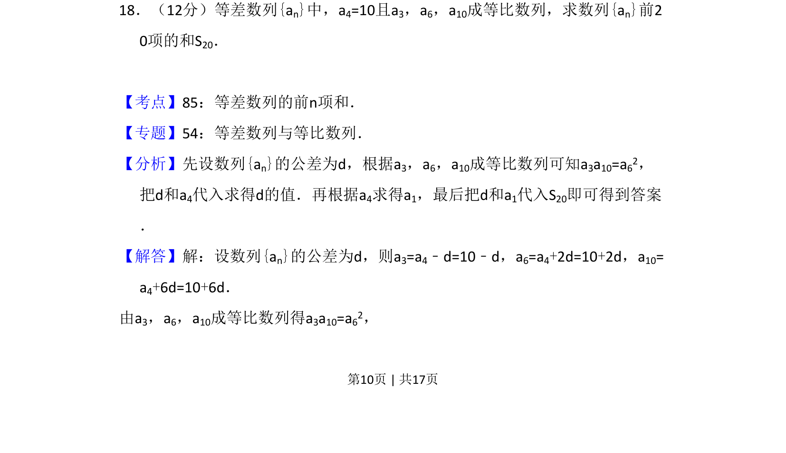
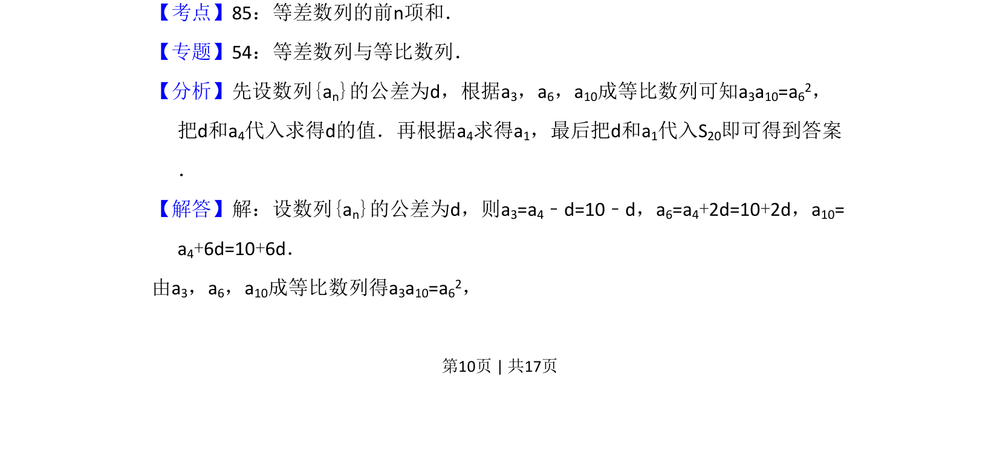
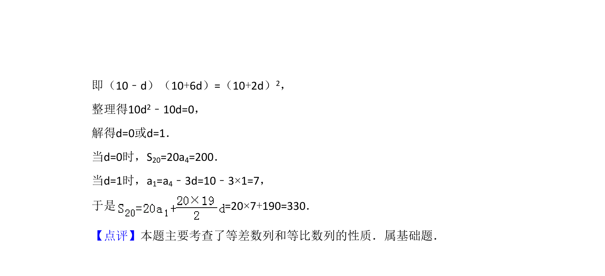

## 题面

## 摘要

等差数列a₄=10且a₃、a₆、a₁₀成等比，求公差d后算出a₁，再求前20项和S₂₀。

## 关联考点

- [[381-数列概念-高中|数列]]
- [[356-等差数列概念|等差数列]]
- [[358-等比数列概念|等比数列]]

## 答案与解析

> 📄 原 PDF 第 10 页：`素材/真题/吉林/2008-2024·（吉林）数学高考真题/2008年高考数学试卷（文）（全国卷Ⅱ）（解析卷）.pdf`
