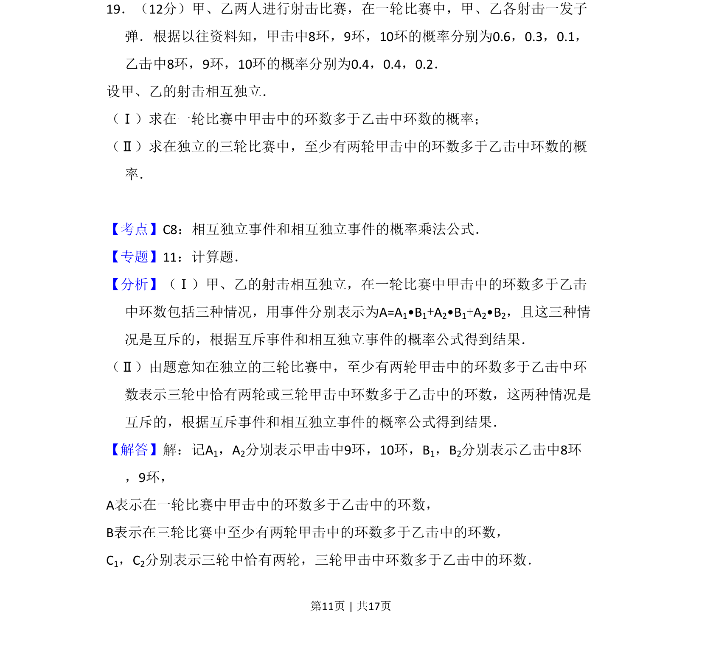

## 题面

## 摘要

甲、乙射击比赛，求甲击中的环数多于乙的概率及三轮中至少两轮满足该条件的概率。

## 关联考点

- [[468-事件相互独立性-高中|相互独立事件]]
- [[互斥事件的概率]]
- [[概率乘法公式]]
- [[318-事件的独立性|独立重复试验]]

## 答案与解析

> 📄 原 PDF 第 11 页：`素材/真题/吉林/2008-2024·（吉林）数学高考真题/2008年高考数学试卷（文）（全国卷Ⅱ）（解析卷）.pdf`
