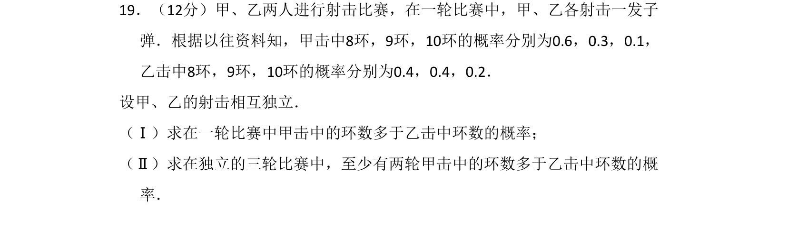
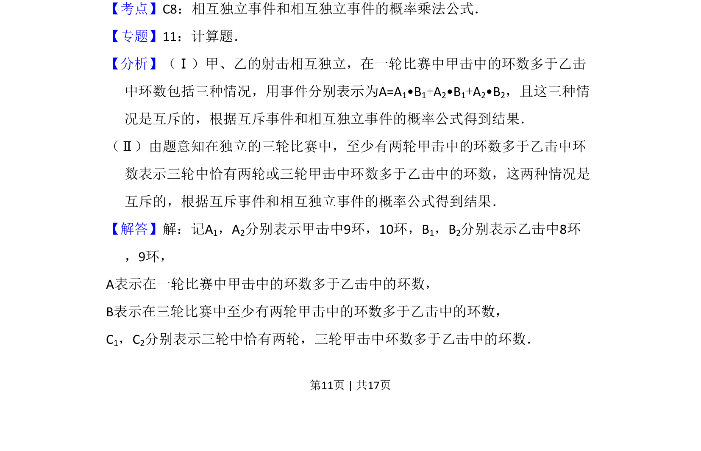
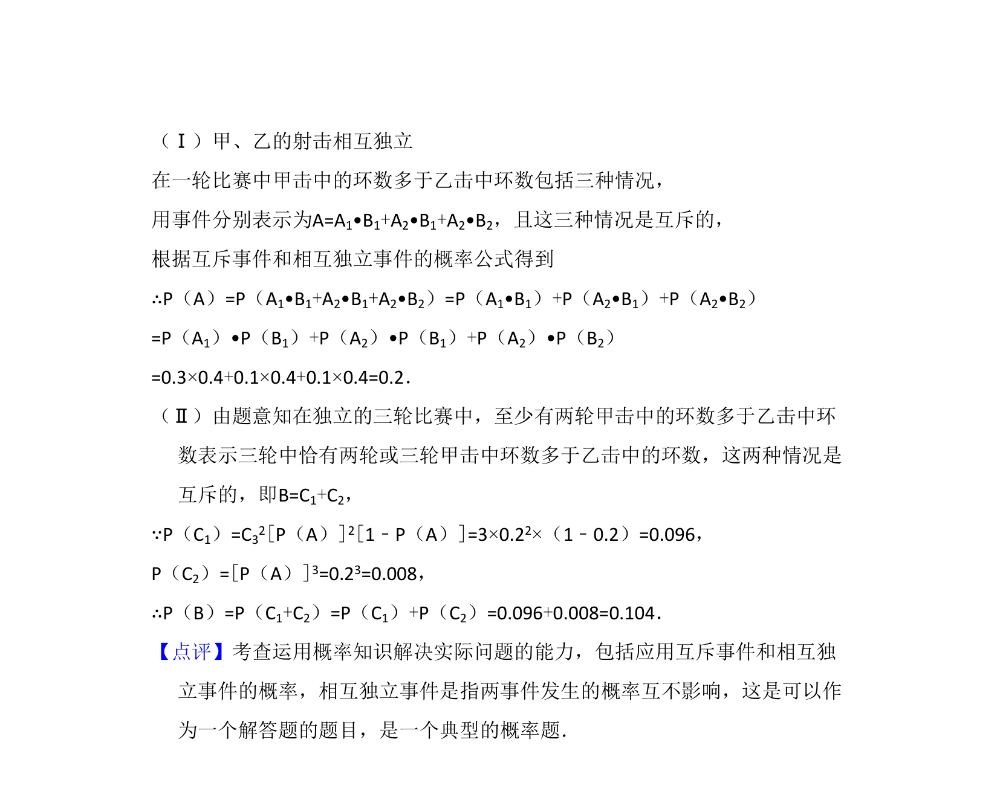

## 题面

## 摘要

甲乙各射一发独立，给出各环概率，求一轮甲环数多于乙的概率，及三轮中至少两轮甲领先的概率。

## 关联考点

- [[945-概率|概率]]
- [[317-事件的关系运算|独立事件]]
- [[031-搭配|排列组合]]

## 答案与解析

> 📄 原 PDF 第 11 页：`素材/真题/吉林/2008-2024·（吉林）数学高考真题/2008年高考数学试卷（文）（全国卷Ⅱ）（解析卷）.pdf`

<!-- 题干文本-start -->
## 题干文本
19．（12分）甲、乙两人进行射击比赛，在一轮比赛中，甲、乙各射击一发子
弹．根据以往资料知，甲击中8环，9环，10环的概率分别为0.6，0.3，0.1，
乙击中8环，9环，10环的概率分别为0.4，0.4，0.2．
设甲、乙的射击相互独立．
（Ⅰ）求在一轮比赛中甲击中的环数多于乙击中环数的概率；
（Ⅱ）求在独立的三轮比赛中，至少有两轮甲击中的环数多于乙击中环数的概
率．
<!-- 题干文本-end -->

<!-- 解析文本-start -->
## 解析文本
【考点】C8：相互独立事件和相互独立事件的概率乘法公式．菁优网版权所有
【专题】11：计算题．
【分析】（Ⅰ）甲、乙的射击相互独立，在一轮比赛中甲击中的环数多于乙击
中环数包括三种情况，用事件分别表示为A=A1•B1+A2•B1+A2•B2，且这三种情
况是互斥的，根据互斥事件和相互独立事件的概率公式得到结果．
（Ⅱ）由题意知在独立的三轮比赛中，至少有两轮甲击中的环数多于乙击中环
数表示三轮中恰有两轮或三轮甲击中环数多于乙击中的环数，这两种情况是
互斥的，根据互斥事件和相互独立事件的概率公式得到结果．
【解答】解：记A1，A2分别表示甲击中9环，10环，B1，B2分别表示乙击中8环
，9环，
A表示在一轮比赛中甲击中的环数多于乙击中的环数，
B表示在三轮比赛中至少有两轮甲击中的环数多于乙击中的环数，
C1，C2分别表示三轮中恰有两轮，三轮甲击中环数多于乙击中的环数．
<!-- 解析文本-end -->
