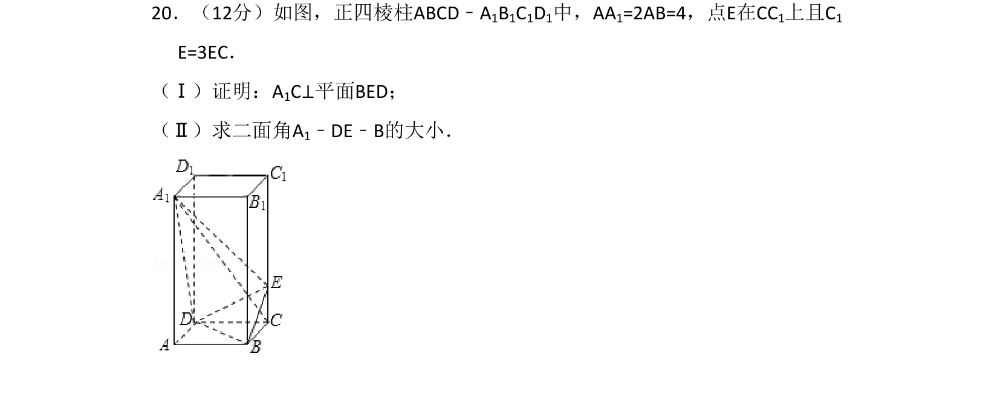
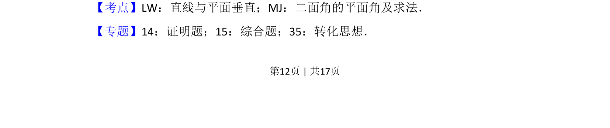
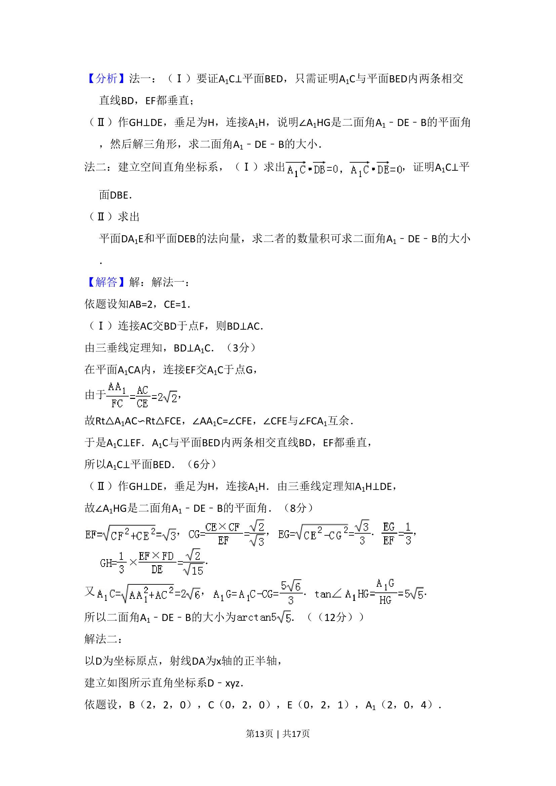
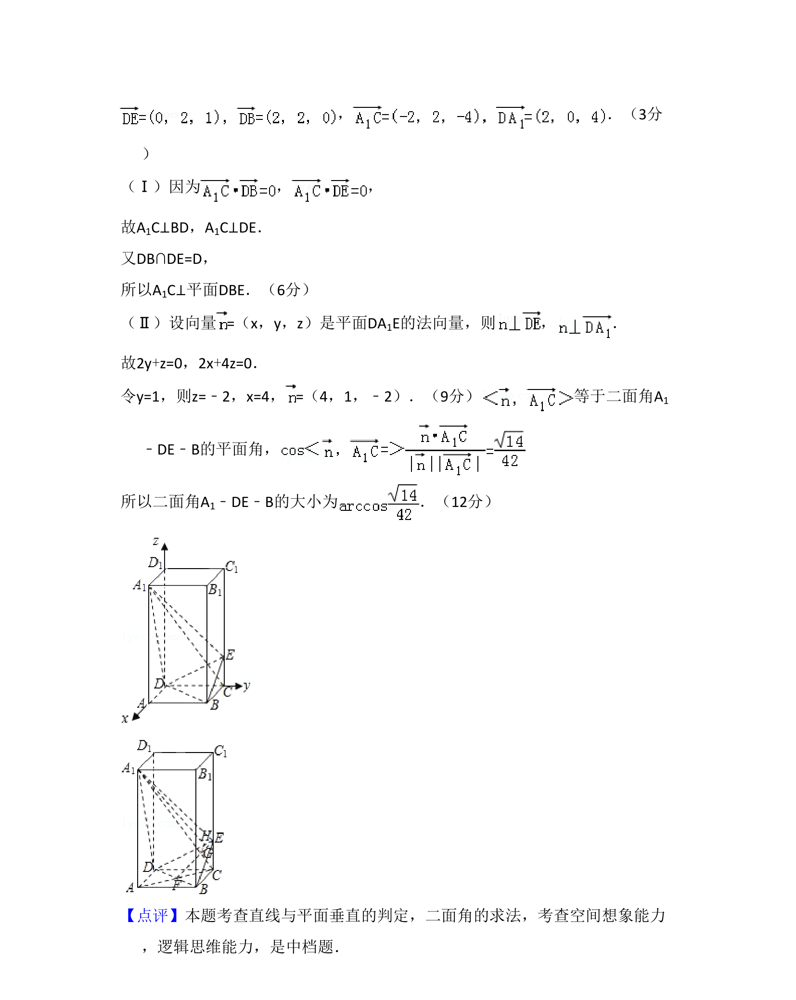

## 题面

## 摘要

正四棱柱ABCD-A₁B₁C₁D₁中E在CC₁上，证A₁C⊥平面BED，再求二面角A₁-DE-B的大小。

## 关联考点

- [[1055-立体几何|立体几何]]
- [[1086-线面垂直的判定与性质|线面垂直]]
- [[353-空间角|二面角]]

## 答案与解析

> 📄 原 PDF 第 12 页：`素材/真题/吉林/2008-2024·（吉林）数学高考真题/2008年高考数学试卷（文）（全国卷Ⅱ）（解析卷）.pdf`

<!-- 题干文本-start -->
## 题干文本
20．（12分）如图，正四棱柱ABCD﹣A1B1C1D1中，AA1=2AB=4，点E在CC1上且C1
E=3EC．
（Ⅰ）证明：A1C⊥平面BED；
（Ⅱ）求二面角A1﹣DE﹣B的大小．
<!-- 题干文本-end -->

<!-- 解析文本-start -->
## 解析文本
【考点】LW：直线与平面垂直；MJ：二面角的平面角及求法．菁优网版权所有
【专题】14：证明题；15：综合题；35：转化思想．
<!-- 解析文本-end -->
