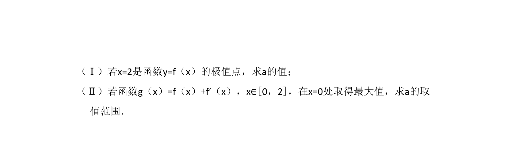
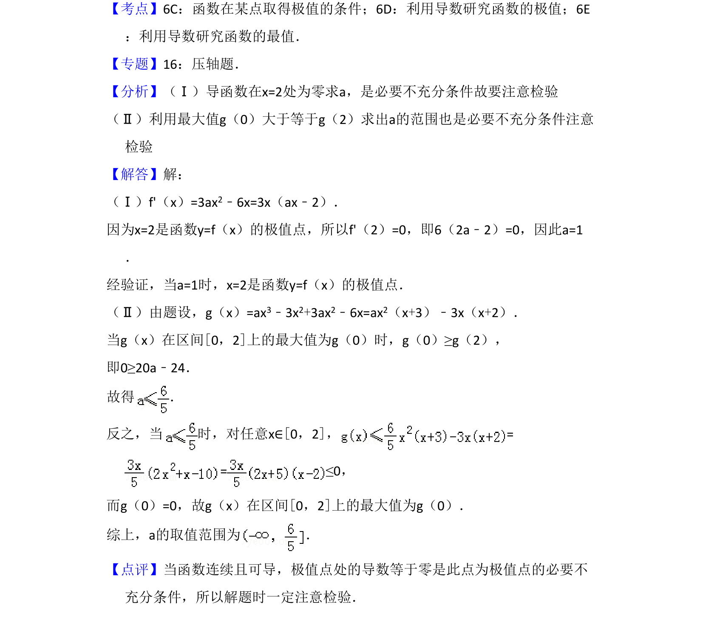

## 题面

## 摘要

f(x)=ax³-3x²，由极值点条件求a，再利用导数研究g(x)=f(x)+f'(x)在[0,2]最大值点为x=0时a的取值范围。

## 关联考点

- [[425-反函数导数|导数]]
- [[286-函数的最值|极值]]
- [[188-函数概念|函数]]

## 答案与解析

> 📄 原 PDF 第 14 页：`素材/真题/吉林/2008-2024·（吉林）数学高考真题/2008年高考数学试卷（文）（全国卷Ⅱ）（解析卷）.pdf`
