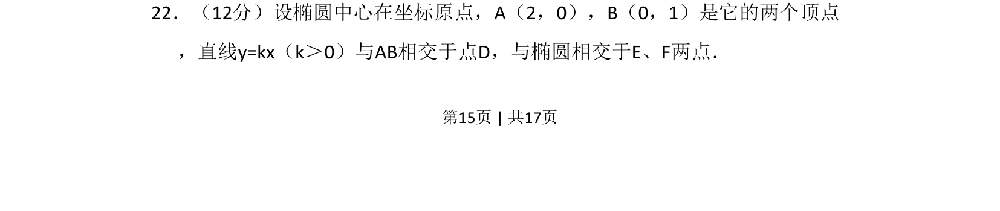
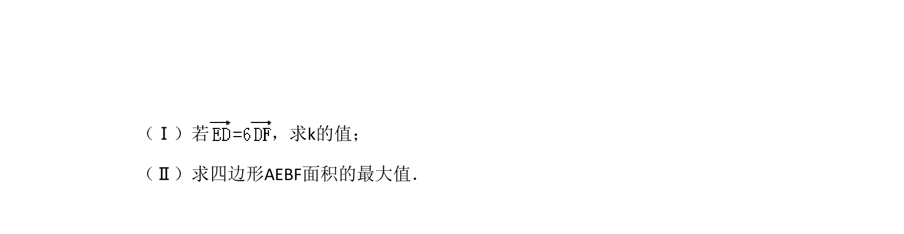
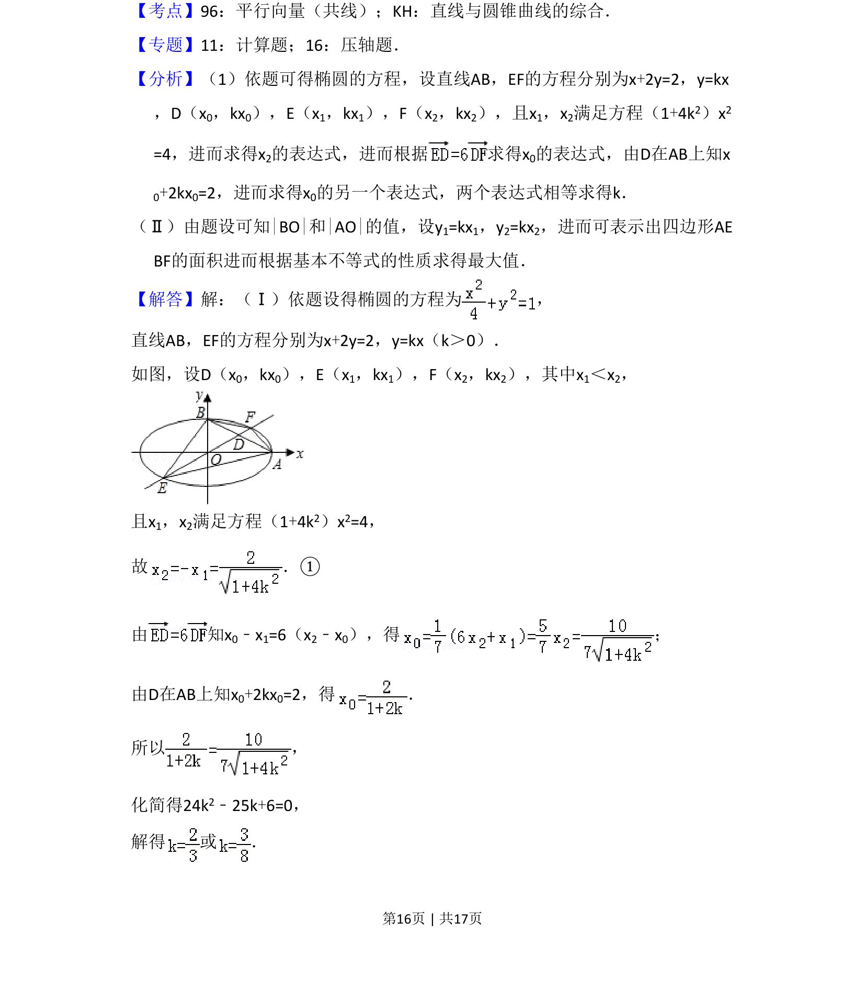
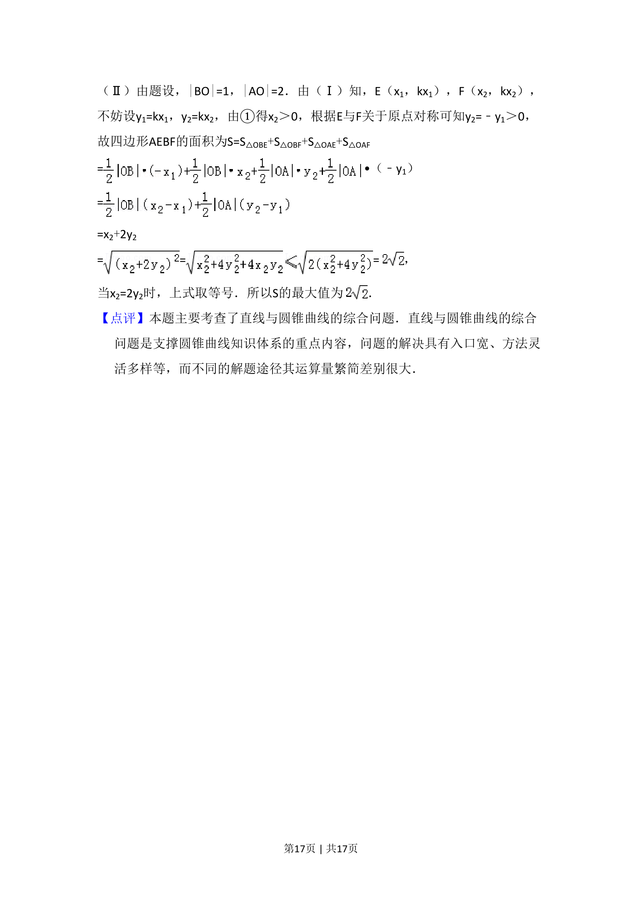

## 题面

## 摘要

椭圆中心原点，顶点A(2,0)、B(0,1)，直线y=kx与AB交于D与椭圆交E、F，由向量条件求k，再求四边形AEBF面积最大值。

## 关联考点

- [[解析几何]]
- [[389-椭圆定义与方程|椭圆]]
- [[329-向量的概念|向量]]

## 答案与解析

> 📄 原 PDF 第 15 页：`素材/真题/吉林/2008-2024·（吉林）数学高考真题/2008年高考数学试卷（文）（全国卷Ⅱ）（解析卷）.pdf`
