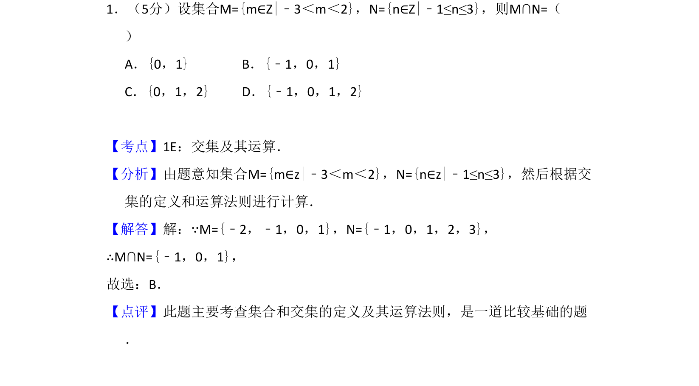
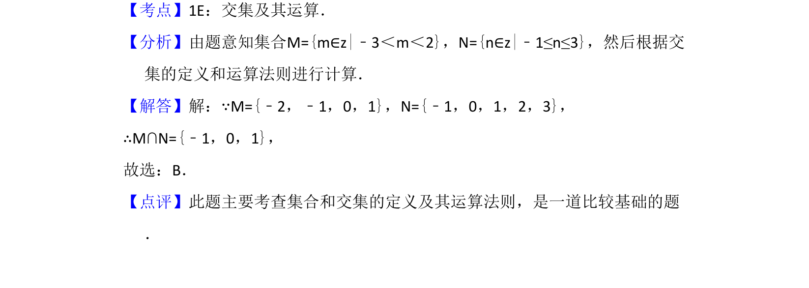

## 题面

## 摘要

此题考查集合的列举法表示与交集运算，需根据给定不等式确定整数集合并求公共元素。

## 关联考点

- [[1141-集合表示法|集合表示法]]
- [[645-交集及其运算|交集及其运算]]

## 答案与解析

> 📄 原 PDF 第 1 页：`素材/真题/吉林/2008-2024·（吉林）数学高考真题/2008年高考数学试卷（理）（全国卷Ⅱ）（解析卷）.pdf`
