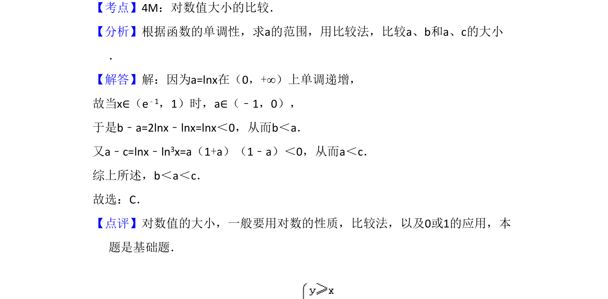

## 题面

## 摘要

考查对数函数在特定区间内的单调性及利用比较法判断对数值大小。

## 关联考点

- [[298-对数函数|对数函数]]
- [[719-单调性|单调性]]
- [[1159-比较法|比较法]]
- [[826-对数值大小|对数值大小]]

## 答案与解析

> 📄 原 PDF 第 2 页：`素材/真题/吉林/2008-2024·（吉林）数学高考真题/2008年高考数学试卷（理）（全国卷Ⅱ）（解析卷）.pdf`

<!-- 题干文本-start -->
## 题干文本
4．（5分）若x∈（e﹣1，1），a=lnx，b=2lnx，c=ln3x，则（　　）
A．a＜b＜c B．c＜a＜b C．b＜a＜c D．b＜c＜a
<!-- 题干文本-end -->

<!-- 解析文本-start -->
## 解析文本
【考点】4M：对数值大小的比较．菁优网版权所有
【分析】根据函数的单调性，求a的范围，用比较法，比较a、b和a、c的大小
．
【解答】解：因为a=lnx在（0，+∞）上单调递增，
故当x∈（e﹣1，1）时，a∈（﹣1，0），
于是b﹣a=2lnx﹣lnx=lnx＜0，从而b＜a．
又a﹣c=lnx﹣ln3x=a（1+a）（1﹣a）＜0，从而a＜c．
综上所述，b＜a＜c．
故选：C．
【点评】对数值的大小，一般要用对数的性质，比较法，以及0或1的应用，本
题是基础题．
<!-- 解析文本-end -->
