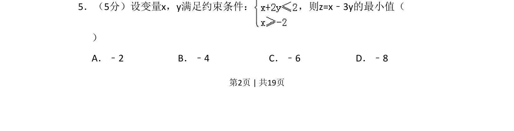
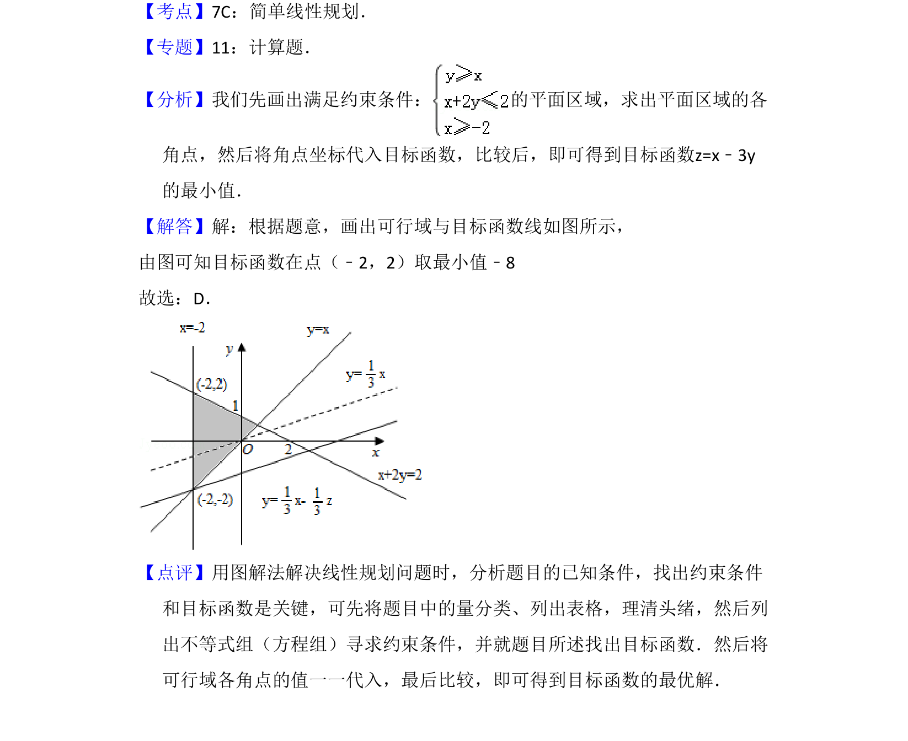

## 题面

## 摘要

考查线性约束条件下目标函数的最小值求解，需画出可行域并平移目标函数直线。

## 关联考点

- [[1074-简单线性规划|线性规划]]
- [[1156-可行域|可行域]]
- [[1000-目标函数最值|目标函数最值]]
- [[769-图解法|图解法]]

## 答案与解析

> 📄 原 PDF 第 2 页：`素材/真题/吉林/2008-2024·（吉林）数学高考真题/2008年高考数学试卷（理）（全国卷Ⅱ）（解析卷）.pdf`
