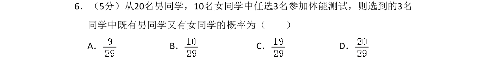
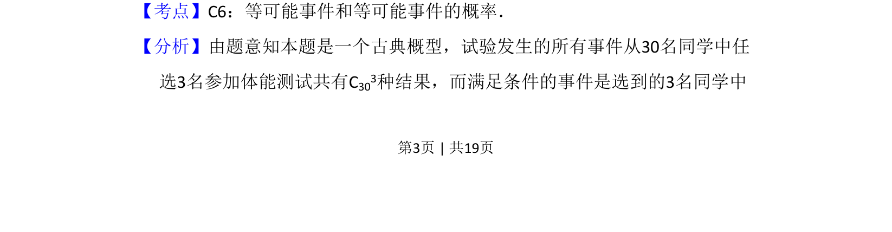
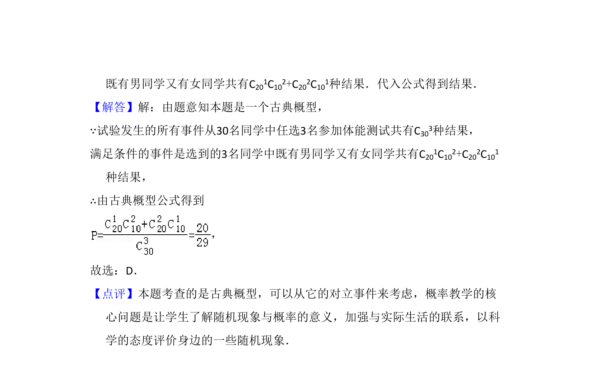

## 题面

## 摘要

从30名同学中选3人，求既有男生又有女生的概率，考查古典概型与组合计数。

## 关联考点

- [[320-古典概型|古典概型]]
- [[1090-组合计数|组合计数]]
- [[948-概率计算|概率计算]]

## 答案与解析

> 📄 原 PDF 第 3 页：`素材/真题/吉林/2008-2024·（吉林）数学高考真题/2008年高考数学试卷（理）（全国卷Ⅱ）（解析卷）.pdf`

<!-- 题干文本-start -->
## 题干文本
6．（5分）从20名男同学，10名女同学中任选3名参加体能测试，则选到的3名
同学中既有男同学又有女同学的概率为（　　）
A．B．C．D．
<!-- 题干文本-end -->

<!-- 解析文本-start -->
## 解析文本
【考点】C6：等可能事件和等可能事件的概率．菁优网版权所有
【分析】由题意知本题是一个古典概型，试验发生的所有事件从30名同学中任
选3名参加体能测试共有C303种结果，而满足条件的事件是选到的3名同学中
<!-- 解析文本-end -->
