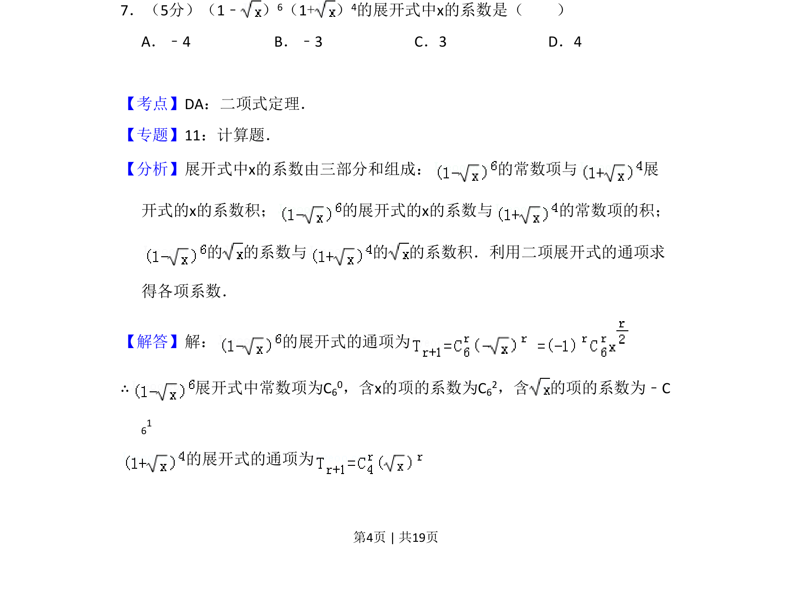
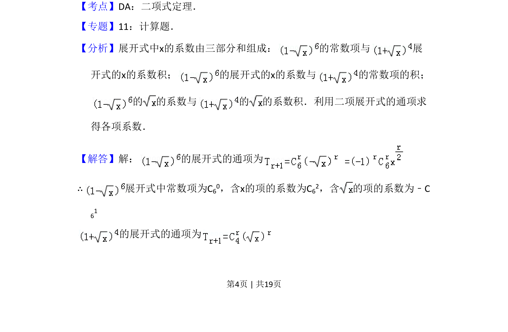
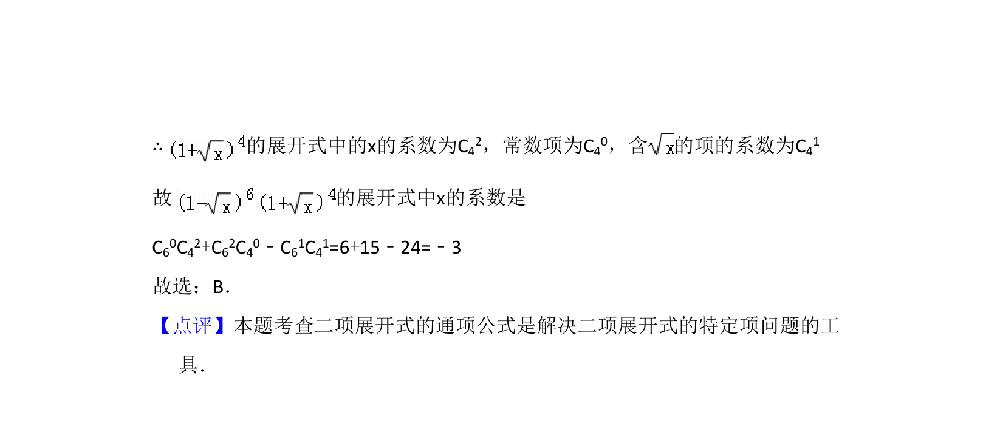

## 题面

## 摘要

求两个二项式乘积展开式中x的系数，需分别展开并组合各项系数。

## 关联考点

- [[472-二项式定理|二项式定理]]
- [[1160-展开式通项|展开式通项]]
- [[1080-系数组合|系数组合]]

## 答案与解析

> 📄 原 PDF 第 4 页：`素材/真题/吉林/2008-2024·（吉林）数学高考真题/2008年高考数学试卷（理）（全国卷Ⅱ）（解析卷）.pdf`

<!-- 题干文本-start -->
## 题干文本
7．（5分）（1﹣ ） 6（1+） 4的展开式中x的系数是（　　）
A．﹣4 B．﹣3 C．3 D．4
<!-- 题干文本-end -->

<!-- 解析文本-start -->
## 解析文本
【考点】DA：二项式定理．菁优网版权所有
【专题】11：计算题．
【分析】展开式中x的系数由三部分和组成： 的常数项与 展
开式的x的系数积； 的展开式的x的系数与 的常数项的积；
的 的系数与 的 的系数积．利用二项展开式的通项求
得各项系数．
【解答】解： 的展开式的通项为
∴展开式中常数项为C 60，含x的项的系数为C62，含 的项的系数为﹣C
61
的展开式的通项为
<!-- 解析文本-end -->
