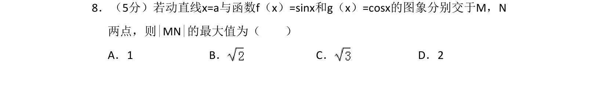
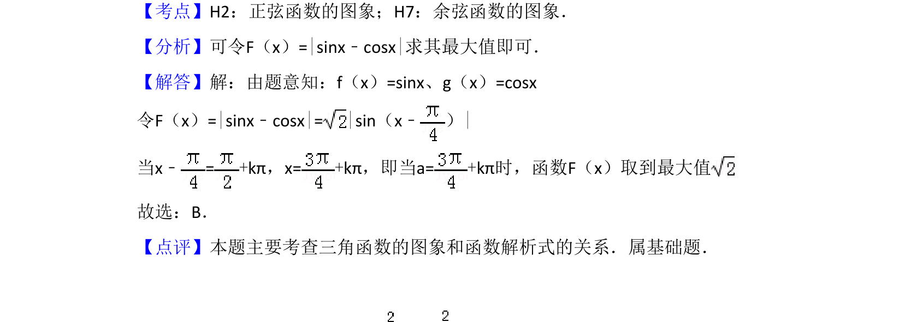

## 题面

## 摘要

本题通过动直线与正弦、余弦函数图像交点的纵坐标之差构造绝对值函数，求该差值的最大值。

## 关联考点

- [[962-正弦函数的图象|正弦函数的图象]]
- [[654-余弦函数的图象|余弦函数的图象]]
- [[615-三角函数的最值|三角函数的最值]]

## 答案与解析

> 📄 原 PDF 第 5 页：`素材/真题/吉林/2008-2024·（吉林）数学高考真题/2008年高考数学试卷（理）（全国卷Ⅱ）（解析卷）.pdf`
