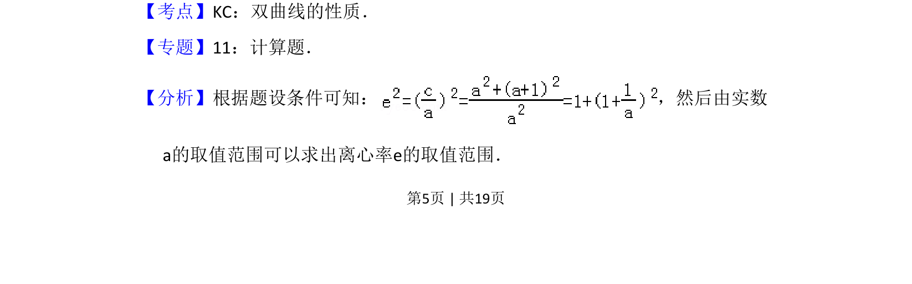
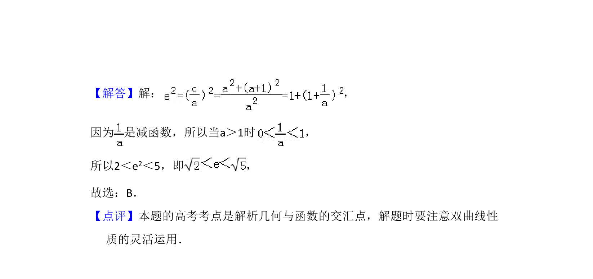

## 题面

## 摘要

根据双曲线方程和参数范围求离心率的取值范围。

## 关联考点

- [[731-双曲线的性质|双曲线的性质]]
- [[391-椭圆离心率|离心率]]
- [[726-参数范围|参数范围]]

## 答案与解析

> 📄 原 PDF 第 5 页：`素材/真题/吉林/2008-2024·（吉林）数学高考真题/2008年高考数学试卷（理）（全国卷Ⅱ）（解析卷）.pdf`
