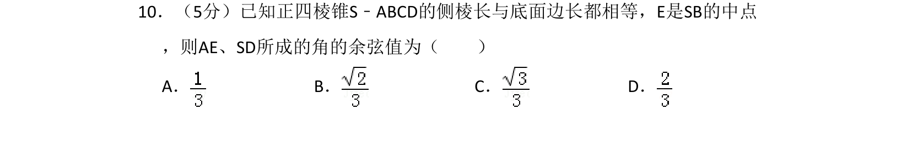
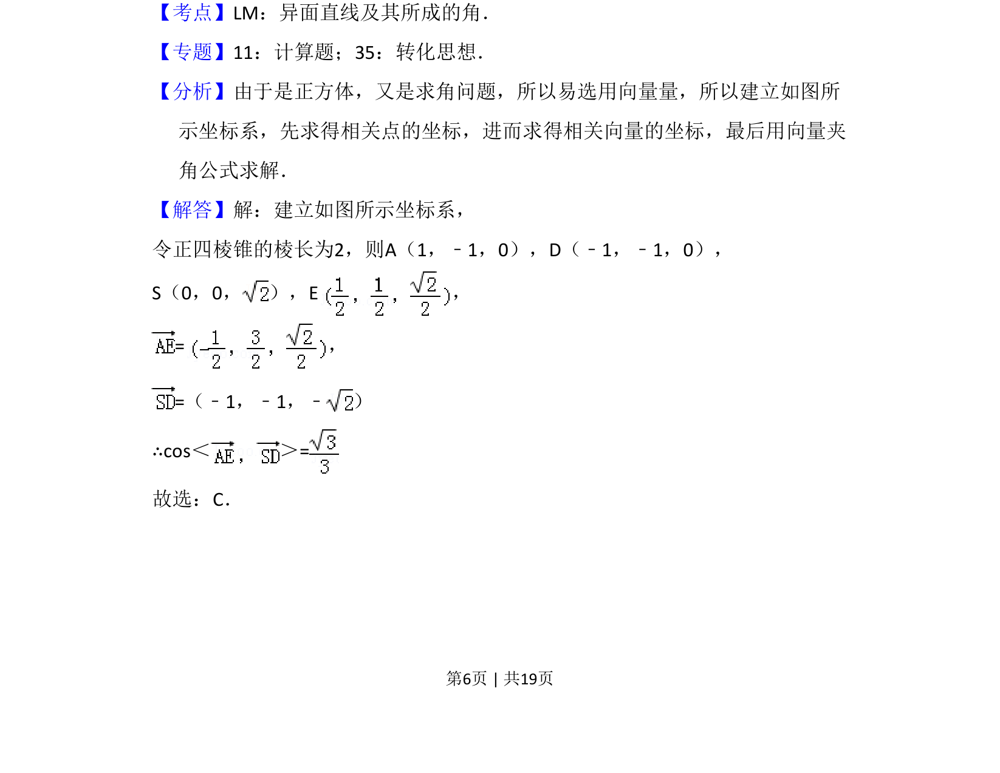
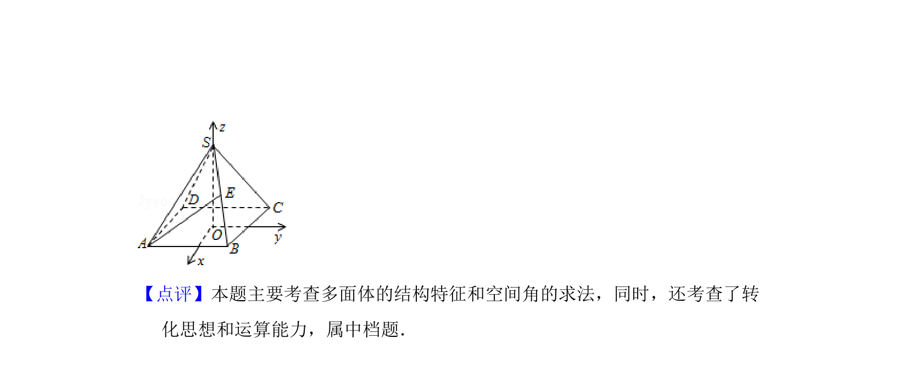

## 题面

## 摘要

已知正四棱锥中侧棱长与底面边长相等，求异面直线所成角的余弦值。

## 关联考点

- [[异面直线及其所成的角]]
- [[410-空间向量运算|空间向量运算]]
- [[几何法向量坐标化]]

## 答案与解析

> 📄 原 PDF 第 6 页：`素材/真题/吉林/2008-2024·（吉林）数学高考真题/2008年高考数学试卷（理）（全国卷Ⅱ）（解析卷）.pdf`
