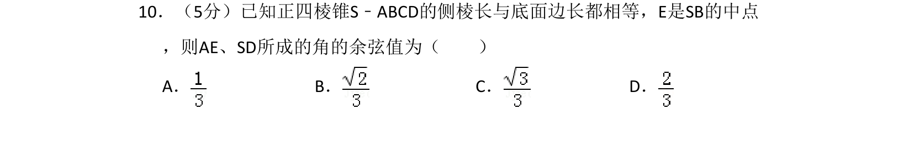
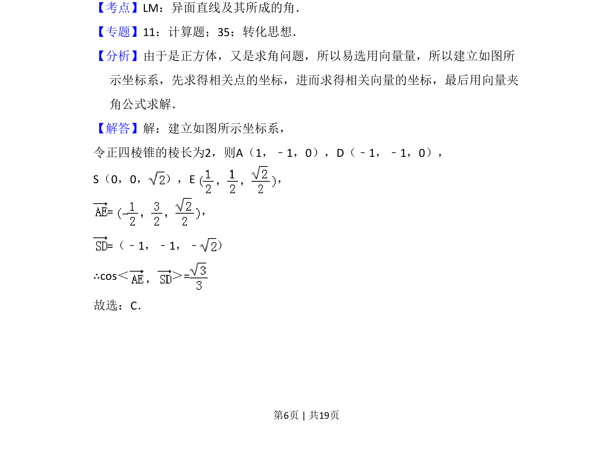
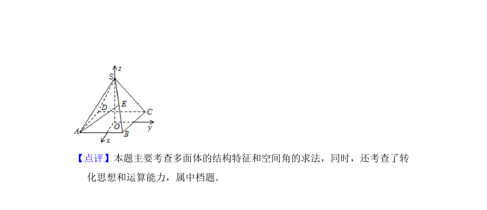

## 题面

## 摘要

已知正四棱锥中侧棱长与底面边长相等，求异面直线所成角的余弦值。

## 关联考点

- [[862-异面直线及其所成的角|异面直线及其所成的角]]
- [[410-空间向量运算|空间向量运算]]
- [[669-几何法向量坐标化|几何法向量坐标化]]

## 答案与解析

> 📄 原 PDF 第 6 页：`素材/真题/吉林/2008-2024·（吉林）数学高考真题/2008年高考数学试卷（理）（全国卷Ⅱ）（解析卷）.pdf`

<!-- 题干文本-start -->
## 题干文本
10．（5分）已知正四棱锥S﹣ABCD的侧棱长与底面边长都相等，E是SB的中点
，则AE、SD所成的角的余弦值为（　　）
A．B．C．D．
<!-- 题干文本-end -->

<!-- 解析文本-start -->
## 解析文本
【考点】LM：异面直线及其所成的角．菁优网版权所有
【专题】11：计算题；35：转化思想．
【分析】由于是正方体，又是求角问题，所以易选用向量量，所以建立如图所
示坐标系，先求得相关点的坐标，进而求得相关向量的坐标，最后用向量夹
角公式求解．
【解答】解：建立如图所示坐标系，
令正四棱锥的棱长为2，则A（1，﹣1，0），D（﹣1，﹣1，0），
S（0，0， ），E，
=，
=（﹣1，﹣1，﹣ ）
∴cos＜ ＞=
故选：C．
<!-- 解析文本-end -->
