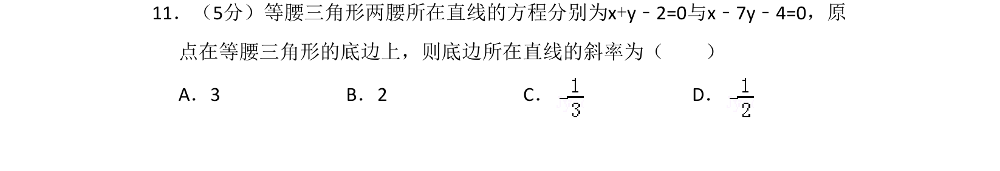
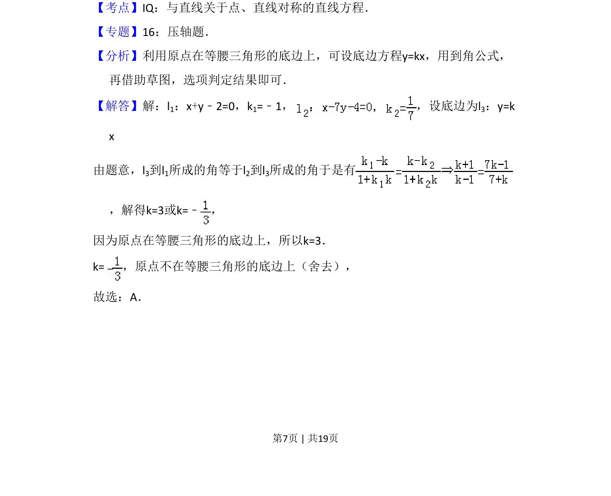
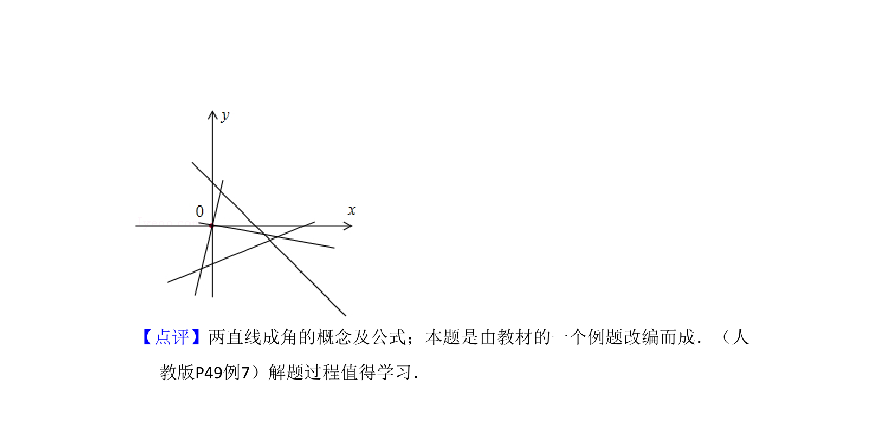

## 题面

## 摘要

等腰三角形两腰方程已知，原点在底边上，利用到角公式求底边斜率，涉及直线对称性。

## 关联考点

- [[1026-直线方程|直线方程]]
- [[1214-到角公式|到角公式]]
- [[1023-直线对称|直线对称]]

## 答案与解析

> 📄 原 PDF 第 7 页：`素材/真题/吉林/2008-2024·（吉林）数学高考真题/2008年高考数学试卷（理）（全国卷Ⅱ）（解析卷）.pdf`

<!-- 题干文本-start -->
## 题干文本
11．（5分）等腰三角形两腰所在直线的方程分别为x+y﹣2=0与x﹣7y﹣4=0，原
点在等腰三角形的底边上，则底边所在直线的斜率为（　　）
A．3 B．2 C．D．
<!-- 题干文本-end -->

<!-- 解析文本-start -->
## 解析文本
【考点】IQ：与直线关于点、直线对称的直线方程．菁优网版权所有
【专题】16：压轴题．
【分析】利用原点在等腰三角形的底边上，可设底边方程y=kx，用到角公式，
再借助草图，选项判定结果即可．
【解答】解：l1：x+y﹣2=0，k1=﹣1， ，设底边为l 3：y=k
x
由题意，l3到l1所成的角等于l2到l3所成的角于是有
，解得k=3或k=﹣ ，
因为原点在等腰三角形的底边上，所以k=3．
k=，原点不在等腰三角形的底边上（舍去），
故选：A．
<!-- 解析文本-end -->
