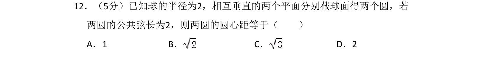
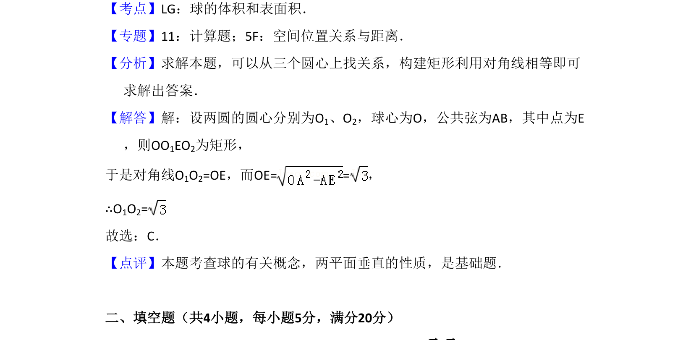

## 题面

## 摘要

两个垂直平面截球所得圆，已知公共弦长，求两圆圆心距。

## 关联考点

- [[球截面圆性质]]
- [[350-空间点直线平面位置关系|空间位置关系]]
- [[189-勾股定理|勾股定理]]

## 答案与解析

> 📄 原 PDF 第 8 页：`素材/真题/吉林/2008-2024·（吉林）数学高考真题/2008年高考数学试卷（理）（全国卷Ⅱ）（解析卷）.pdf`
