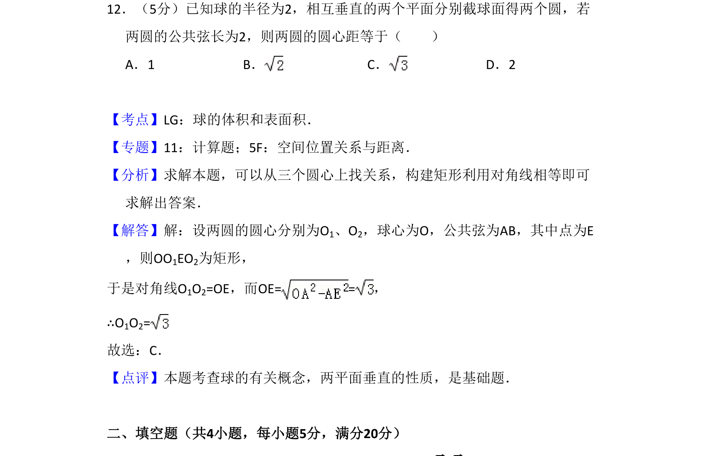
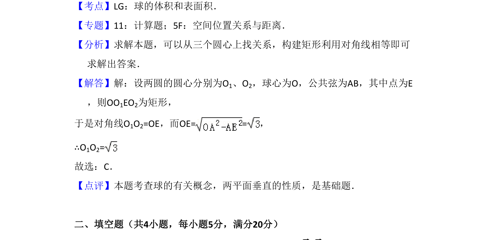

## 题面

## 摘要

两个垂直平面截球所得圆，已知公共弦长，求两圆圆心距。

## 关联考点

- [[990-球截面圆性质|球截面圆性质]]
- [[350-空间点直线平面位置关系|空间位置关系]]
- [[189-勾股定理|勾股定理]]

## 答案与解析

> 📄 原 PDF 第 8 页：`素材/真题/吉林/2008-2024·（吉林）数学高考真题/2008年高考数学试卷（理）（全国卷Ⅱ）（解析卷）.pdf`

<!-- 题干文本-start -->
## 题干文本
12．（5分）已知球的半径为2，相互垂直的两个平面分别截球面得两个圆，若
两圆的公共弦长为2，则两圆的圆心距等于（　　）
A．1 B．C．D．2
<!-- 题干文本-end -->

<!-- 解析文本-start -->
## 解析文本
【考点】LG：球的体积和表面积．菁优网版权所有
【专题】11：计算题；5F：空间位置关系与距离．
【分析】求解本题，可以从三个圆心上找关系，构建矩形利用对角线相等即可
求解出答案．
【解答】解：设两圆的圆心分别为O1、O2，球心为O，公共弦为AB，其中点为E
，则OO1EO2为矩形，
于是对角线O1O2=OE，而OE= =，
∴O1O2=
故选：C．
【点评】本题考查球的有关概念，两平面垂直的性质，是基础题．
　
二、填空题（共4小题，每小题5分，满分20分）
<!-- 解析文本-end -->
