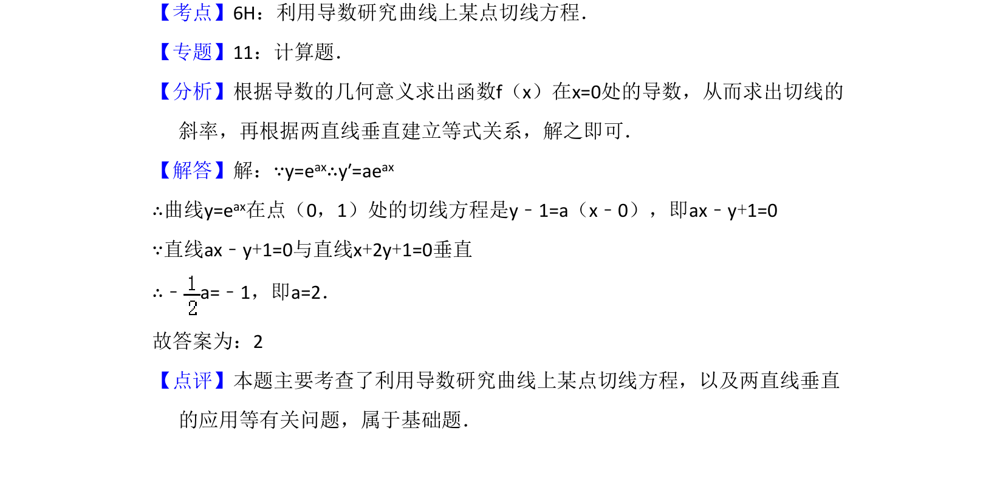

## 题面

## 摘要

求曲线切线方程，并利用两直线垂直条件求参数值。

## 关联考点

- [[710-利用导数研究曲线上某点切线方程|利用导数研究曲线上某点切线方程]]
- [[627-两直线垂直|两直线垂直]]

## 答案与解析

> 📄 原 PDF 第 9 页：`素材/真题/吉林/2008-2024·（吉林）数学高考真题/2008年高考数学试卷（理）（全国卷Ⅱ）（解析卷）.pdf`

<!-- 题干文本-start -->
## 题干文本
14．（5分）设曲线y=eax在点（0，1）处的切线与直线x+2y+1=0垂直，则a=　2　
．
<!-- 题干文本-end -->

<!-- 解析文本-start -->
## 解析文本
【考点】6H：利用导数研究曲线上某点切线方程．菁优网版权所有
【专题】11：计算题．
【分析】根据导数的几何意义求出函数f（x）在x=0处的导数，从而求出切线的
斜率，再根据两直线垂直建立等式关系，解之即可．
【解答】解：∵y=eax∴y′=aeax
∴曲线y=eax在点（0，1）处的切线方程是y﹣1=a（x﹣0），即ax﹣y+1=0
∵直线ax﹣y+1=0与直线x+2y+1=0垂直
∴﹣a=﹣1，即a=2．
故答案为：2
【点评】本题主要考查了利用导数研究曲线上某点切线方程，以及两直线垂直
的应用等有关问题，属于基础题．
<!-- 解析文本-end -->
