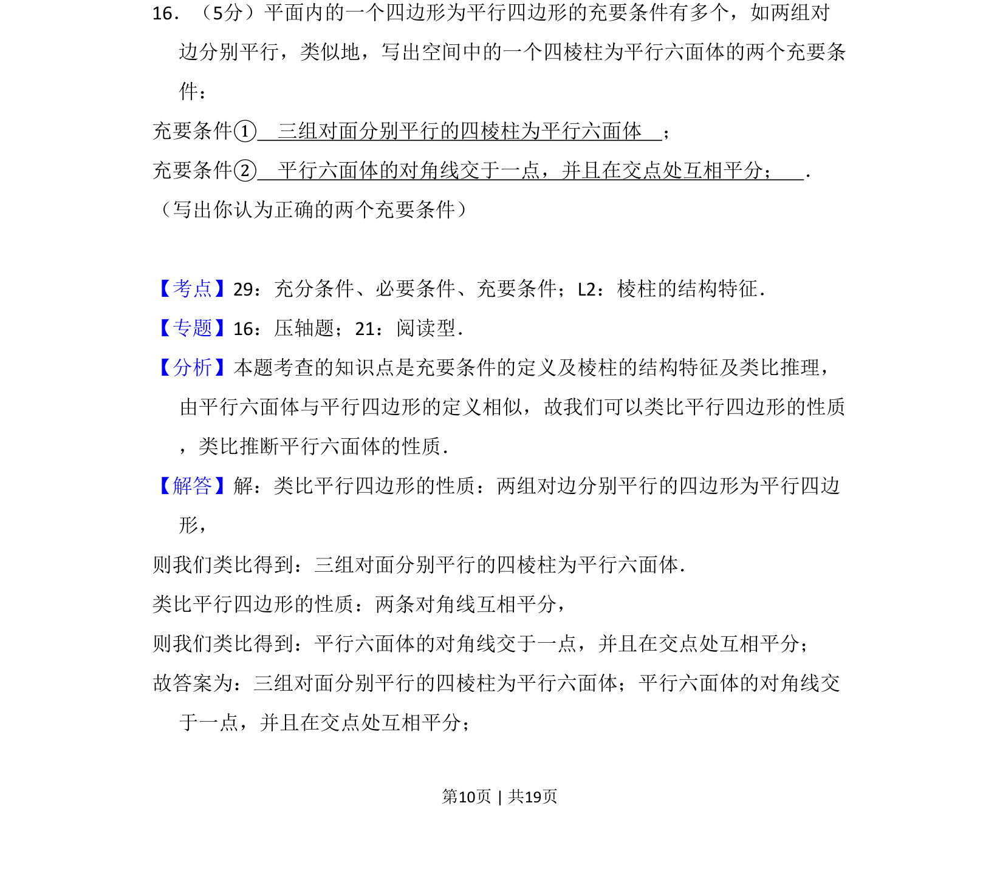
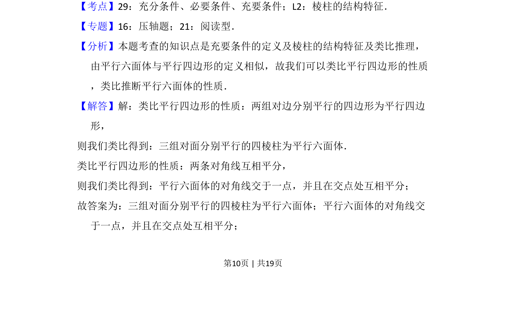
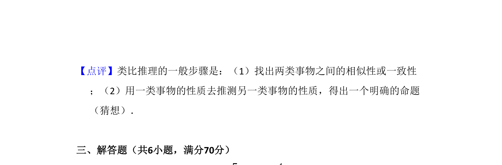

## 题面

## 摘要

通过类比平行四边形充要条件，写出平行六面体的两个充要条件。

## 关联考点

- [[279-充要条件|充要条件]]
- [[934-棱柱的结构特征|棱柱的结构特征]]
- [[1077-类比推理|类比推理]]

## 答案与解析

> 📄 原 PDF 第 10 页：`素材/真题/吉林/2008-2024·（吉林）数学高考真题/2008年高考数学试卷（理）（全国卷Ⅱ）（解析卷）.pdf`

<!-- 题干文本-start -->
## 题干文本
16．（5分）平面内的一个四边形为平行四边形的充要条件有多个，如两组对
边分别平行，类似地，写出空间中的一个四棱柱为平行六面体的两个充要条
件：
充要条件①　三组对面分别平行的四棱柱为平行六面体　；
充要条件②　平行六面体的对角线交于一点，并且在交点处互相平分；　．
（写出你认为正确的两个充要条件）
<!-- 题干文本-end -->

<!-- 解析文本-start -->
## 解析文本
【考点】29：充分条件、必要条件、充要条件；L2：棱柱的结构特征．菁优网版权所有
【专题】16：压轴题；21：阅读型．
【分析】本题考查的知识点是充要条件的定义及棱柱的结构特征及类比推理，
由平行六面体与平行四边形的定义相似，故我们可以类比平行四边形的性质
，类比推断平行六面体的性质．
【解答】解：类比平行四边形的性质：两组对边分别平行的四边形为平行四边
形，
则我们类比得到：三组对面分别平行的四棱柱为平行六面体．
类比平行四边形的性质：两条对角线互相平分，
则我们类比得到：平行六面体的对角线交于一点，并且在交点处互相平分；
故答案为：三组对面分别平行的四棱柱为平行六面体；平行六面体的对角线交
于一点，并且在交点处互相平分；
<!-- 解析文本-end -->
